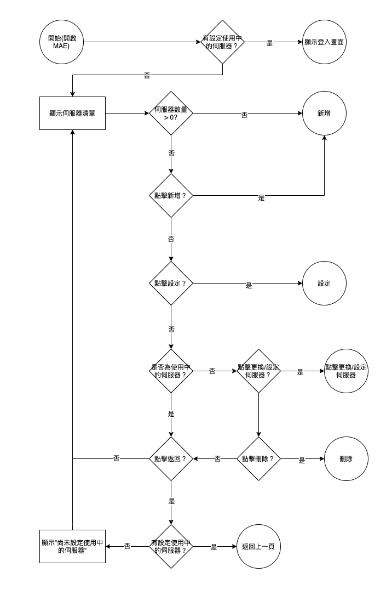

# 擴充MAE伺服器清單列表

### 
規劃人員

* Andy

#### 
版本記錄

  |日期|版本|備註|
  |---|---|---|
  |2021/4/12|v1|初始化|

### 
TRAC

#### 
規格說明

* 可記錄多筆伺服器設定及各伺服器的名稱和各伺服器的登入帳密

### 
功能說明

  * 需求展開  
    * 新增伺服器
      * 可新增可連線的伺服器
    * 刪除伺服器
      * 可刪除列表中的伺服器
    * 伺服器名稱
      * 可修改列表中的伺服器
    * 登入狀態記錄
      * 可記錄登入帳密及記錄勾選設定，一個伺服器只記錄一組

#### 
畫面

  * 新增伺服器(紅框為伺服器清單)
  
    

  * 伺服器清單(紅框為修改名稱，藍框為刪除伺服器)
  
    

  * 修改伺服器名稱
  
    

  * 記錄登入帳密(紅框處)

    

#### 
作業流程

  * 新增伺服器
  
    

  * 伺服器清單
  
    

  * 修改伺服器名稱
  
    