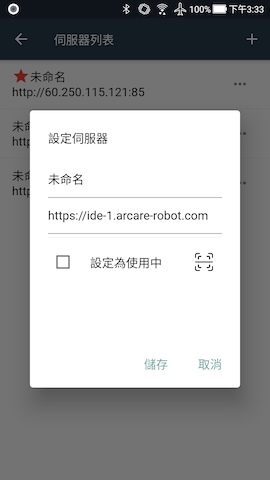
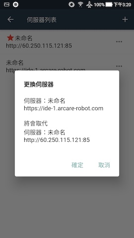
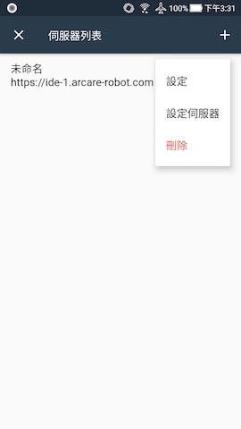
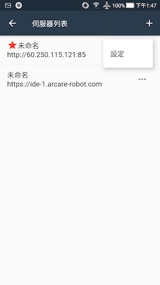
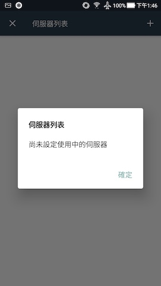
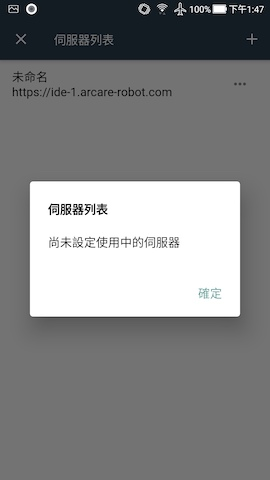
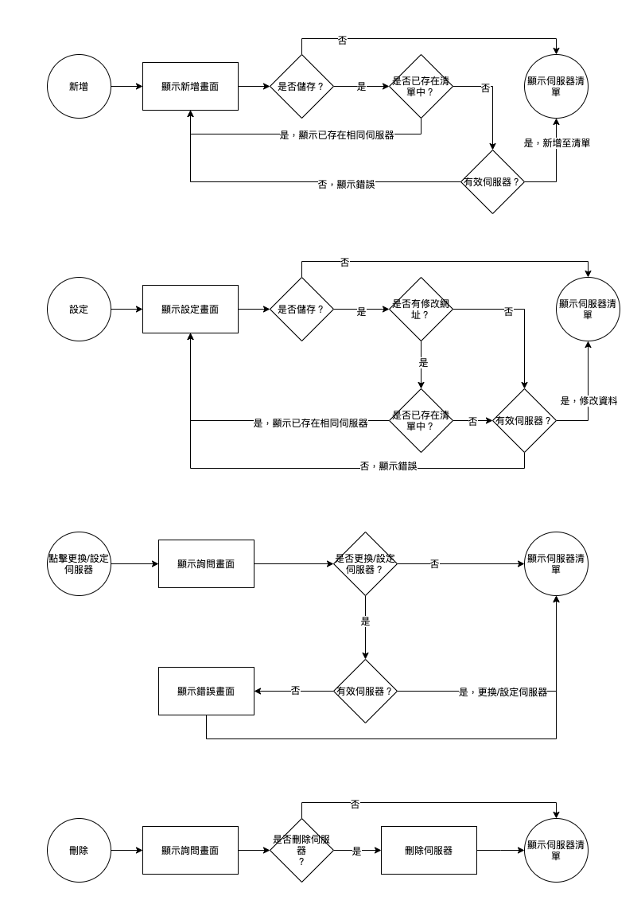

# 擴充MAE伺服器清單列表

### 
規劃人員

* Andy

#### 
版本記錄

  |日期|版本|備註|
  |---|---|---|
  |2021/4/12|v1|初始化|

### 
TRAC

#### 
規格說明

* 可記錄多筆伺服器設定及各伺服器的名稱和各伺服器的登入帳密

### 
功能說明

  * 需求展開  
    * 新增伺服器
      * 新增可連線的伺服器
      * 預設名稱"未命名"
      * 預設網址"https://xxxx.arcare-robot.com"
        * 可手動輸入/QRCode輸入
      * 預設未勾選"設定為使用中"
      * 無使用中的伺服器的狀態下會直接顯示新增伺服器畫面
    * 設定(修改伺服器)
      * 可修改名稱/網址/使用中
      * 正在使用中的伺服器不可取消使用中
    * 更換伺服器/設定伺服器
      * 可切換伺服器
      * 正在使用中的伺服器無須切換
    * 刪除伺服器
      * 可刪除列表中的伺服器
      * 正在使用中的伺服器不可刪除
    * 登入狀態記錄
      * 可記錄登入帳密及記錄勾選設定，一個伺服器只記錄一組

#### 
畫面

  * 伺服器清單
  
    

  * 新增伺服器
  
    

  * 設定伺服器(修改伺服器)
  
    

  * 更換伺服器
  
    

  * 刪除伺服器
  
    

  * 功能項目(無設定伺服器)
  
    

  * 功能項目(已設定伺服器)
  
    

  * 功能項目(未設定伺服器)
  
    

  * 返回(無伺服器)
  
    

  * 返回(未設定伺服器)
  
    

  * 記錄登入帳密(紅框處)

    

#### 
作業流程

  * 伺服器清單
  
    

  * 伺服器清單功能
  
    