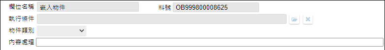

## 
版面相關

* 版面 
    

* [版面資訊通則](../RulesOther/README.md#ruleother1)

## 
動作說明

* ...

## 
欄位說明

* 
主畫面區塊

    
    * (x)物件類別
        * 用途說明
        * 規格說明
            * 選項 網頁/地圖/影片/圖表/系統內表單/檔案櫃圖檔/檔案容器控制/行事曆
                * 依據表單類型顯示不同選項
                    * [新增表單/報表]()(n)設計類型=STD，選項 網頁/地圖/影片/圖表/系統內表單/檔案櫃圖檔
                    * [新增表單/報表]()(n)設計類型=RWD，選項 網頁/地圖/影片/圖表/系統內表單/檔案櫃圖檔/檔案容器控制/行事曆
                    * [新增表單/報表]()(n)設計類型=MAE，選項 網頁/檔案容器控制/行事曆
            * 選項為 [網頁](WebPage)
            * 選項為 [地圖](MAP)
            * 選項為 [影片]()
            * 選項為 [圖表]()
            * 選項為 [系統內表單]()
            * 選項為 [檔案櫃圖檔]()
            * 選項為 [檔案容器控制]()
            * 選項為 [行事曆]()