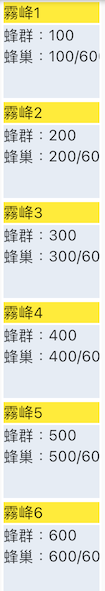
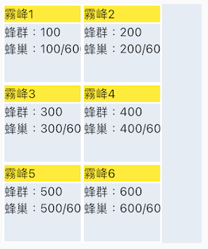
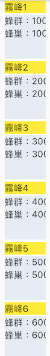
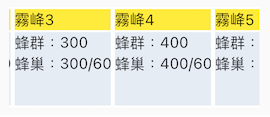
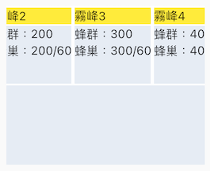
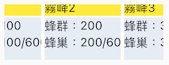

# 元件類型-元件容器

* ## Web支援版本
  
      8.10.1

* ## APP 支援版本

      008.010.001000 以上(含)

* __元件容器__
  * __
元件代碼
__
    * wCtnr
  * __
相依性
__
    * 獨立元件
  * __
版面相關
__
    * 元件寬高
      * 高度
        * 區塊模式=單列式
          * 高度=變動高度
            * 元件的高度依`區塊區`縮放
        * 區塊模式=磚塊式
          * 高度=固定高度
          * 高度=變動高度
            * 元件的高度依`區塊區`縮放
      * 寬度(%)
        不含 `外邊距`的左邊距/右邊距：(單元樣式/外邊距/(左邊距/右邊距))
        * 區塊模式=單列式
          * 區塊寬度=元件寬度
        * 區塊模式=磚塊式
          * 磚塊為固定寬度
          * 滑動方向=上下滑動
            * 超過元件寬度時折行
      * 當裝置的大小不同時，可能導致元件寬高會改變
    * 區塊寬高
      * 高度
        * 區塊模式=單列式
          * 區塊為變動高度
        * 區塊模式=磚塊式
          * 區塊為固定高度
      * 寬度
        * 區塊模式=單列式
          * 區塊寬度=元件寬度
        * 區塊模式=磚塊式
          * 區塊為固定寬度
    * 滑動方向
      * 上下滑動
        * 區塊模式=磚塊式
          * 超過元件寬度時折行
      * 左右滑動
        * 固定只顯示一行
        * 區塊模式=磚塊式
          * 當 元件高度=固定高度 且 小於區塊高度時，可以`上下滑動`
    * 資料間距
      * 套用`區塊樣式`的外邊距
    * [元件樣式](../general/style)
      * 
致能(Apps_Enable)

        * 區塊模式=單列式/磚塊式
          * 背景
            * 顏色
            * 透明度
            * 漸層色
            * 漸層方向
          * ~`內容`~
          * 框線
            * 線條
              * 無
              * 實線
              * 虛線
              * 嵌入線
              * 浮出線
            * 圓角
              * `當圓角<寬度且線條=虛線時，會強制設定圓角=寬度`
            * 左框線
              * 寬度
              * 顏色
            * 上框線
              * 寬度
              * 顏色
            * 右框線
              * 寬度
              * 顏色
            * 下框線
              * 寬度
              * 顏色
          * 邊界
            * 內間距
              * 上
              * 下
              * 左
              * 右
            * 外邊距
              * 上
              * 下
              * 左
              * 右
          * 光棒(lightBar)
            * 線條
              * 無
              * 實線
              * 虛線
              * 嵌入線
              * 浮出線
            * 上框線
              * 寬度
              * 顏色
            * 下框線
              * 寬度
              * 顏色
            * 左框線
              * 寬度
              * 顏色
            * 右框線
              * 寬度
              * 顏色
            * 顏色
            * 透明度
            * 漸層色
            * 漸層方向
      * 
區塊(Apps_Block)

        * 區塊模式=單列式/磚塊式
          * 背景
            * 顏色
            * 透明度
            * 漸層色
            * 漸層方向
          * ~`內容`~
          * 框線
            * 線條
              * 無
              * 實線
              * 虛線
              * 嵌入線
              * 浮出線
            * 圓角
              * `當圓角<寬度且線條=虛線時，會強制設定圓角=寬度`
            * 左框線
              * 寬度
              * 顏色
            * 上框線
              * 寬度
              * 顏色
            * 右框線
              * 寬度
              * 顏色
            * 下框線
              * 寬度
              * 顏色
          * 邊界
            * 內間距
              * 左
              * 上
              * 右
              * 下
            * 外邊距
              * 左
              * 上
              * 右
              * 下
          * ~`光棒(lightBar)`~
    * `注意`
      * 若元件為`固定高度`且`元件高度 > 手機畫面`時，當元件畫面佔滿`螢幕畫面(表單可顯示區域)`時將`無法滑動`表單層
    * [行樣式(Row)](../general/style)
      * 
行致能(Apps_Enable)

        * 背景
          * 顏色
          * 透明度
          * 漸層色
          * 漸層方向
        * ~`內容`~
        * 框線
          * 線條
            * 無
            * 實線
            * 虛線
            * 嵌入線
            * 浮出線
          * 圓角
            * `當圓角<寬度且線條=虛線時，會強制設定圓角=寬度`
          * 左框線
            * 寬度
            * 顏色
          * 上框線
            * 寬度
            * 顏色
          * 右框線
            * 寬度
            * 顏色
          * 下框線
            * 寬度
            * 顏色
        * 邊界
          * 內間距
            * 上
            * 下
            * 左
            * 右
          * ~`外邊距`~
        * ~`光棒(lightBar)`~
    * [列樣式(Column)](../general/style)
      * 
行致能(Apps_Enable)

        * 背景
          * 顏色
          * 透明度
          * 漸層色
          * 漸層方向
        * ~`內容`~
        * 框線
          * 線條
            * 無
            * 實線
            * 虛線
            * 嵌入線
            * 浮出線
          * 圓角
            * `當圓角<寬度且線條=虛線時，會強制設定圓角=寬度`
          * 左框線
            * 寬度
            * 顏色
          * 上框線
            * 寬度
            * 顏色
          * 右框線
            * 寬度
            * 顏色
          * 下框線
            * 寬度
            * 顏色
        * 邊界
          * 內間距
            * 上
            * 下
            * 左
            * 右
          * ~`外邊距`~
        * ~`光棒(lightBar)`~
    * 
預設樣式

      * 區塊模式=單列式/磚塊式
        * 元件樣式
          * 背景顏色＝[0xFFFFFFFF]
          * 光棒
            * 背景顏色＝[0xFFFFFFFF]
            * 邊框 顏色=[0xFF3F51B5]，線條＝虛線，圓角=1，寬度＝2
        * 區塊樣式
          * 背景
            * 顏色=[0xFFFFFFFF]
          * 邊框
            * 顏色=[0xFF9E9E9E]，線條＝實線，圓角=1，寬度＝1
          * 內邊距
            * 左=上=右=下=0
          * 外邊距
            * 左=上=右=下=2
        * 行樣式
          * 無
        * 列樣式
          * 無
  * __
加註
__
    * - [x] [基本設定](../Addition/component/basicSettings)
    * - [ ] [預設給值](../Addition/component/defaultValue)
    * - [x] [更新給值](../Addition/component/updateValue)
    * - [ ] [被動更新](../Addition/component/passiveUpdate)
    * - [ ] [編輯能力](../Addition/component/editting)
    * - [x] [顯示設定](../Addition/component/display)
            顯示設定-背景色，僅套用至區塊
    * - [ ] [檢控限制](../Addition/component/prosecutionResstrucson)
    * - [ ] [嵌入物件](../Addition/component/embedded)
    * - [ ] [選項清單](../Addition/component/optionList)
  * __
行為
__
    * 支援的子元件類型
          註：皆強制為僅供顯示
      * 文字標題
      * 文字方塊
      * 多行文字
      * 下拉選項
      * 清單選項
      * 按鈕群組
      * 按鈕選項
      * 核取方塊
      * 圖片
      * 框線
      * 畫布
    * 受權限保護元件：(Trac #7477)
      - [ ] 支援
      - [x] 不支援
    * 對應檔區：
      * 表單元件/基本設定/存在檔區
    * 對應欄位：
      - [ ] 支援
      - [x] 不支援
    * 顯示巨集：
      - [ ] 支援
      - [x] 不支援
    * 模版：
      - [ ] 支援
      - [x] 不支援
    * 提示：
      - [ ] 支援
      - [x] 不支援
    * 錯誤顯示：
      - [ ] 支援
      - [x] 不支援
    * 資料過濾：
      - [ ] 支援
      - [x] 不支援
    * 資料搜尋：
      - [ ] 支援
      - [x] 不支援
    * 檔區每次下載筆數：
      * 表單版面
        * 滑動方向=上下滑動
          * 50筆
        * 滑動方向=左右滑動
          * 10筆
    * 編輯模式：不支援
    * 瀏覧模式：
      * 樣式
        * 顯示行樣式`(行樣式會包住列樣式)`
        * 顯示列樣式
        * 顯示區塊樣式`(區塊樣式會包住行樣式)`
        * 駐留筆
          * 顯示光棒樣式`(光棒樣式會取代區塊樣式，不包含內間距/外邊距)`
      * 顯示樣式
        * 表單元件/顯示設定/顏色(背景色)
          * 僅套用至區塊
    * 預設載入筆數:
      * 表單版面
        * 滑動方向=上下滑動
          * 先載入50筆。若後面還有時向下滑到最底時再往上滑動會再載入50筆，當前會保留100筆資料，超過部份不保留。
        * 滑動方向=左右滑動：
          * 先載入10筆。若後面還有時向左滑到底再往左滑動會再載入10筆，當前會保留20筆資料，超過部份不保留。
    * 開單隱藏：
      - [ ] 支援
      - [x] 不支援
    * 資料隱藏：
      - [ ] 支援
      - [x] 不支援
    * 元件隱藏：
      - [x] 支援
      - [ ] 不支援
    * 元件除能：
      - [ ] 支援
      - [x] 不支援
    * 元件駐留：
      - [ ] 支援
      - [x] 不支援
    * 操作：
      * 點擊 (記錄移動)
    * 檔區更新
      * 整個檔區：(按鍵/基本設定/重顯網格/資料行更新方式＝全部記錄)
        * 重顯畫面
              駐留筆不存在時，會停留在上一筆或下一筆
      * 駐留筆：(按鍵/基本設定/重顯網格/資料行更新方式＝駐留筆)
        * 駐留筆不存在時
              更新`整個檔區`
        * 駐留筆存在時
              刷新駐留筆資料

#### 
畫面

* 元件示意圖
  * 類型＝磚塊式
    * 滑動方向＝上下滑動
    
      
    
      * 元件寬度 > 區塊寬度
        
        

      * 元件高度 < 區塊高度
        
        
      
    * 滑動方向＝左右滑動
    
      
    
      * 元件高度 = 固定高度
        * 元件高度 > 區塊高度
        
          

        * 元件高度 < 區塊高度 => 可上下滑動
        
          
