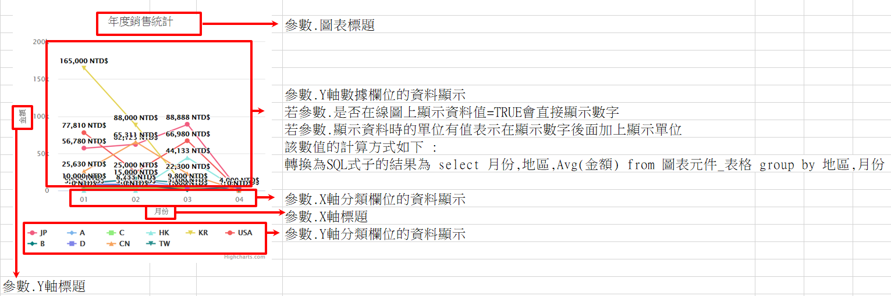
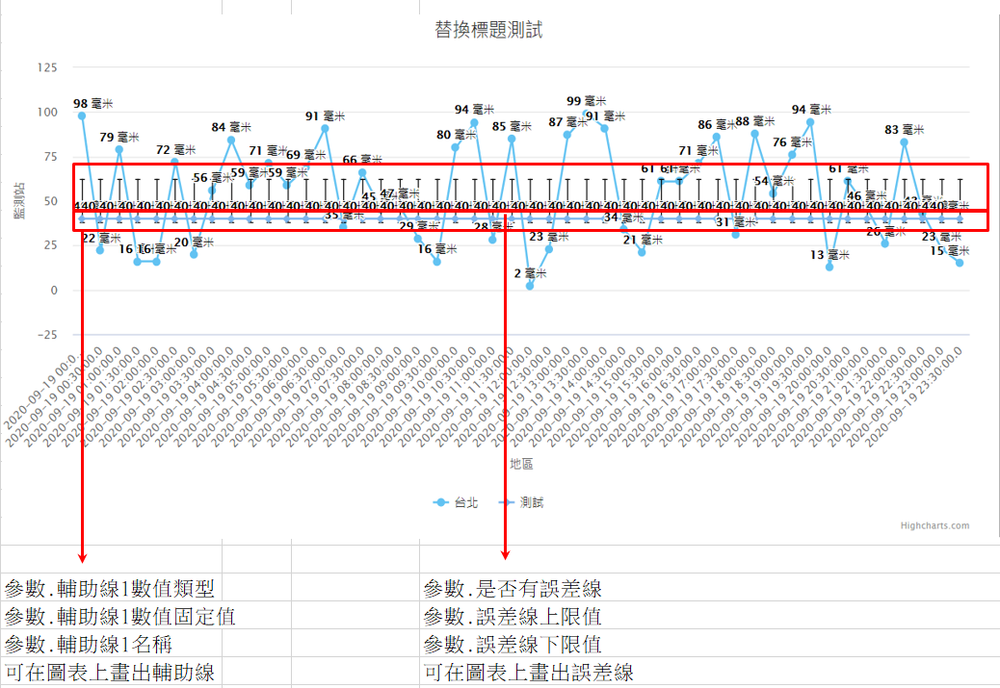

### 
趨勢圖 <path>(物件類別\圖表\圖表類型)

| 參數名稱        | 可空白	  	  | 來源型態	   | 參數說明	    |
|:------------- |:------------- |:------------- |:------------- |
| 圖表標題	| V	| 多語詞庫	| 顯示圖表的標題| 
| X軸標題	| 	| 多語詞庫	| X軸顯示標題| 
| Y軸標題	| 	| 多語詞庫	| Y軸顯示標題| 
| 來源邏輯表格	| 	| 檢視表	| 顯示圖表的資料來源| 
| 來源過濾運算式	| V| 	條件式	| 顯示圖表的資料來源過濾式| 
| X軸分類欄位	| 	| 查表欄位	| 圖表X軸分群用的欄位名稱| 
| Y軸分類欄位	| V	| 查表欄位	| 圖表Y軸分群用的欄位名稱，<ps>當參數.X軸區段數有值，本參數無效</ps>| 
| Y軸數據欄位	| 	| 查表欄位	| 圖表Y軸的資料欄位| 
| Y軸數據計算方式	| 	| 選項	| 1.Max : 顯示Y軸數據欄位的最大值 2.Min : 顯示Y軸數據欄位的最小值 3.Sum : 顯示Y軸數據欄位的總和 4.Avg : 顯示Y軸數據欄位的平均值 5.Count : 顯示Y軸數據欄位的數量| 
| 顯示資料時的單位	| V	| 多語詞庫	| 顯示在數據資料後的單位名稱| 
| 是否在線圖上顯示資料值	| 	| 選項	| TRUE / FALSE| 
| 排序方式	| V	| 選項	| 1.升冪/2.降冪  | 未設定時為升冪| 
| X軸區段數 	| V	| 固定值	| 表示X軸要依據資料最大最小值當作區間切成幾等份| 
| X軸模板	| V	| 選項	| 當X軸區段數有設定時，X軸資料顯示模板，<ps>當參數.X軸區段數有值時，本參數必須有值</ps>。 1.原值 2.整數 3.小數兩位 4.年 5.月 6.日 7.年/月 8.年/月/日 9.月/日 10.月/日 時:分 11.時:分| 
| 輔助線1數值類型	| V	| 選項	| 1.固定值 / 2.資料來源最小值 / 3.資料來源最大值 / 4.資料來源平均值| 
| 輔助線1數值固定值	| V	| 固定值	| 輔助線的數值，<ps>當參數.輔助線1數值類型為1.固定值，本參數必須有值</ps>| 
| 輔助線1名稱	| V	| 多語詞庫	| 輔助線的名稱| 
| 輔助線2數值類型	| V	| 選項	| 1.固定值 / 2.資料來源最小值 / 3.資料來源最大值 / 4.資料來源平均值| 
| 輔助線2數值固定值	| V	| 固定值	| 輔助線的數值，<ps>當參數.輔助線2數值類型為1.固定值，本參數必須有值</ps>| 
| 輔助線2名稱	| V	| 多語詞庫	| 輔助線的名稱| 
| 輔助線3數值類型	| V	| 選項	| 1.固定值 / 2.資料來源最小值 / 3.資料來源最大值 / 4.資料來源平均值| 
| 輔助線3數值固定值	| V	| 固定值	| 輔助線的數值，<ps>當參數.輔助線3數值類型為1.固定值，本參數必須有值</ps>| 
| 輔助線3名稱	| V	| 多語詞庫	| 輔助線的名稱| 
| 是否有誤差線 	| V	| 選項	 | 1.有 / 0.沒有| 
| 誤差上限值欄位	| V	| 查表欄位	| 紀錄誤差上限值的欄位名稱，<ps>當參數.是否有誤差線為1.有，本參數必須有值</ps>| 
| 誤差下限值欄位	| V	| 查表欄位	| 紀錄誤差下限值的欄位名稱，<ps>當參數.是否有誤差線為1.有，本參數必須有值</ps>| 
| X軸分群排序欄位	| V	| 查表欄位	| 當有指定時依照此欄位進行X軸分群結果的排序| 
| Y欄分類排序方式	| V	| 選項	| 1.升冪 / 2.降冪| 
| 標題替換字1	| V	| 運算式	| 替換圖表標題裡%P1的值| 
| 標題替換字2	| V	| 運算式	| 替換圖表標題裡%P2的值| 

* 範例說明1 : 趨勢圖依照XY軸分群顯示

    趨勢圖設定

    | 參數名稱	| 來源型態	| 來源內容| 
    |:------------- |:------------- |:------------- |
    | 圖表標題	| 多語詞庫	| 年度銷售統計| 
    | X軸標題	| 多語詞庫	| 月份| 
    | Y軸標題	| 多語詞庫	| 金額| 
    | 來源邏輯表格	| 檢視表	| 圖表元件_表格| 
    | X軸分類欄位	| 查表欄位	| 月份| 
    | Y軸分類欄位	| 查表欄位	| 地區| 
    | Y軸數據欄位	| 查表欄位	| 金額| 
    | Y軸數據計算方式	| 選項	| Avg| 
    | 顯示資料時的單位	| 多語詞庫	| NTD$| 
    | 是否在線圖上顯示資料值	| 選項	| TRUE| 
    | 排序方式	| 選項	| 升冪| 

    檢視表.圖表元件_表格

    | 地區	| 月份	| 金額
    |:------------- |:------------- |:------------- |
    | JP	| 01	| 56780| 
    | JP	| 02	| 62125| 
    | JP	| 03	| 88888| 
    | A	| 01	| 8525| 
    | A	| 02	| 15100| 
    | A	| 03	| 3833| 
    | C	| 01	| 3100| 
    | C	| 02	| 3200| 
    | C	| 03	| 3300| 
    | C	| 04	| 1400| 
    | HK	| 03	| 44133| 
    | KR	| 01	| 165000| 
    | KR	| 02	| 88000| 
    | KR	| 03	| 943| 
    | USA	| 01	| 77810| 
    | USA	| 02	| 25000| 
    | USA	| 03	| 66980| 
    | B	| 01	| 6700| 
    | B	| 02	| 7400| 
    | B	| 03	| 1000| 
    | B	| 04	| 5000| 
    | D	| 01	| 8100| 
    | D	| 02	| 8733| 
    | D	| 03	| 5100| 
    | D	| 04	| 4000| 
    | CN	| 01	| 25630| 
    | CN	| 02	| 65311| 
    | CN	| 03	| 22300| 
    | TW	| 01	| 10000| 
    | TW	| 02	| 15000| 
    | TW	| 03	| 9800| 

    依據設定配合資料，圖表元件顯示結果如下圖所示

    

* 範例說明2 : 趨勢圖依照時間區間顯示資料 + 輔助線 + 誤差線

    趨勢圖設定

    | 參數名稱	| 來源型態	| 來源內容| 
    |:------------- |:------------- |:------------- |
    | 圖表標題	| 多語詞庫	| %P1標題%P2| 
    | X軸標題	| 多語詞庫	| 地區| 
    | Y軸標題	| 多語詞庫	| 監測站| 
    | 來源邏輯表格	| 檢視表	| 元件加註_嵌入物件_圖表_地區雨量資料(Rita)| 
    | X軸分類欄位	| 查表欄位	| 建立時間| 
    | Y軸分類欄位	| 查表欄位	| 監測站| 
    | Y軸數據欄位	| 查表欄位	| 雨量| 
    | Y軸數據計算方式	| 選項	| Avg| 
    | 顯示資料時的單位	| 多語詞庫	| 毫米| 
    | 排序方式	| 選項	| 升冪| 
    | 輔助線1數值類型	| 選項	| 固定值| 
    | 輔助線1數值固定值	| 固定值	| 40| 
    | 輔助線1名稱	| 多語詞庫	| 測試| 
    | 是否有誤差線 	| 選項	 | 有| 
    | 誤差上限值欄位	| 查表欄位	| 誤差上限值| 
    | 誤差下限值欄位	| 查表欄位	| 誤差下限值| 
    | X軸分群排序欄位	| 查表欄位	| 地區排序| 
    | Y欄分類排序方式	| 選項	| 降冪| 
    | 標題替換字1	| 運算式	| 替換| 
    | 標題替換字2	| 運算式	| 測試| 

    檢視表.元件加註_嵌入物件_趨勢圖_等份圖(Rita)

    | 監測站	| 雨量	| 地區	| 地區排序  | 誤差上限值 | 誤差下限值 | 建立時間 |
    |:------------- |:------------- |:------------- |:------------- |:------------- |:------------- |:------------- |
    | 台北        	| 61	| 北部        	| 1	| 62	|38	|2020/9/19 00 : 00 : 00|
    | 台北        	| 16	| 北部        	| 1	| 62	|38	|2020/9/19 00 : 30 : 00|
    | 台北        	| 38	| 北部        	| 1	| 62	|38	|2020/9/19 01 : 00 : 00|
    | 台北        	| 28	| 北部        	| 1	| 62	|38	|2020/9/19 01 : 30 : 00|
    | 台北        	| 52	| 北部        	| 1	| 62	|38	|2020/9/19 02 : 00 : 00|
    | 台北        	| 14	| 北部        	| 1	| 62	|38	|2020/9/19 02 : 30 : 00|
    | 台北        	| 10	| 北部        	| 1	| 62	|38	|2020/9/19 03 : 00 : 00|
    | 台北        	| 39	| 北部        	| 1	| 62	|38	|2020/9/19 03 : 30 : 00|
    | 台北        	| 71	| 北部        	| 1	| 62	|38	|2020/9/19 04 : 00 : 00|
    | 台北        	| 7	    | 北部        	| 1	|62	|38	|2020/9/19 04 : 30 : 00|
    | 台北        	| 21	| 北部        	| 1	|62	|38	|2020/9/19 05 : 00 : 00|
    | 台北        	| 81	| 北部        	| 1	|62	|38	|2020/9/19 05 : 30 : 00|
    | 台北        	| 23	| 北部        	| 1	|62	|38	|2020/9/19 06 : 00 : 00|
    | 台北        	| 10	| 北部        	| 1	|62	|38	|2020/9/19 06 : 30 : 00|
    | 台北        	| 68	| 北部        	| 1	|62	|38	|2020/9/19 07 : 00 : 00|
    | 台北        	| 73	| 北部        	| 1	|62	|38	|2020/9/19 07 : 30 : 00|
    | 台北        	| 41	| 北部        	| 1	|62	|38	|2020/9/19 08 : 00 : 00|
    | 台北        	| 53	| 北部        	| 1	|62	|38	|2020/9/19 08 : 30 : 00|
    | 台北        	| 11	| 北部        	| 1	|62	|38	|2020/9/19 09 : 00 : 00|
    | 台北        	| 98	| 北部        	| 1	|62	|38	|2020/9/19 09 : 30 : 00|
    | 台北        	| 87	| 北部        	| 1	|62	|38	|2020/9/19 10 : 00 : 00|
    | 台北        	| 85	| 北部        	| 1	|62	|38	|2020/9/19 10 : 30 : 00|
    | 台北        	| 11	| 北部        	| 1	|62	|38	|2020/9/19 11 : 00 : 00|
    | 台北        	| 18	| 北部        	| 1	|62	|38	|2020/9/19 11 : 30 : 00|
    | 台北        	| 89	| 北部        	| 1	|62	|38	|2020/9/19 12 : 00 : 00|
    | 台北        	| 80	| 北部        	| 1	|62	|38	|2020/9/19 12 : 30 : 00|
    | 台北        	| 8	    | 北部        	| 1	|62	|38	|2020/9/19 13 : 00 : 00|
    | 台北        	| 68	| 北部        	| 1	|62	|38	|2020/9/19 13 : 30 : 00|
    | 台北        	| 20	| 北部        	| 1	|62	|38	|2020/9/19 14 : 00 : 00|
    | 台北        	| 31	| 北部        	| 1	|62	|38	|2020/9/19 14 : 30 : 00|
    | 台北        	| 98	| 北部        	| 1	|62	|38	|2020/9/19 15 : 00 : 00|
    | 台北        	| 7	    | 北部        	| 1	|62	|38	|2020/9/19 15 : 30 : 00|
    | 台北        	| 13	| 北部        	| 1	|62	|38	|2020/9/19 16 : 00 : 00|
    | 台北        	| 11	| 北部        	| 1	|62	|38	|2020/9/19 16 : 30 : 00|
    | 台北        	| 21	| 北部        	| 1	|62	|38	|2020/9/19 17 : 00 : 00|
    | 台北        	| 12	| 北部        	| 1	|62	|38	|2020/9/19 17 : 30 : 00|
    | 台北        	| 40	| 北部        	| 1	|62	|38	|2020/9/19 18 : 00 : 00|
    | 台北        	| 19	| 北部        	| 1	|62	|38	|2020/9/19 18 : 30 : 00|
    | 台北        	| 47	| 北部        	| 1	|62	|38	|2020/9/19 19 : 00 : 00|
    | 台北        	| 31	| 北部        	| 1	|62	|38	|2020/9/19 19 : 30 : 00|
    | 台北        	| 20	| 北部        	| 1	|62	|38	|2020/9/19 20 : 00 : 00|
    | 台北        	| 79	| 北部        	| 1	|62	|38	|2020/9/19 20 : 30 : 00|
    | 台北        	| 1	    | 北部        	| 1	|62	|38	|2020/9/19 21 : 00 : 00|
    | 台北        	| 54	| 北部        	| 1	|62	|38	|2020/9/19 21 : 30 : 00|
    | 台北        	| 36	| 北部        	| 1	|62	|38	|2020/9/19 22 : 00 : 00|
    | 台北        	| 45	| 北部        	| 1	|62	|38	|2020/9/19 22 : 30 : 00|
    | 台北        	| 55	| 北部        	| 1	|62	|38	|2020/9/19 23 : 00 : 00|
    | 台北        	| 88	| 北部        	| 1	|62	|38	|2020/9/19 23 : 30 : 00|

    依據設定配合資料，圖表元件顯示結果如下圖所示

    
