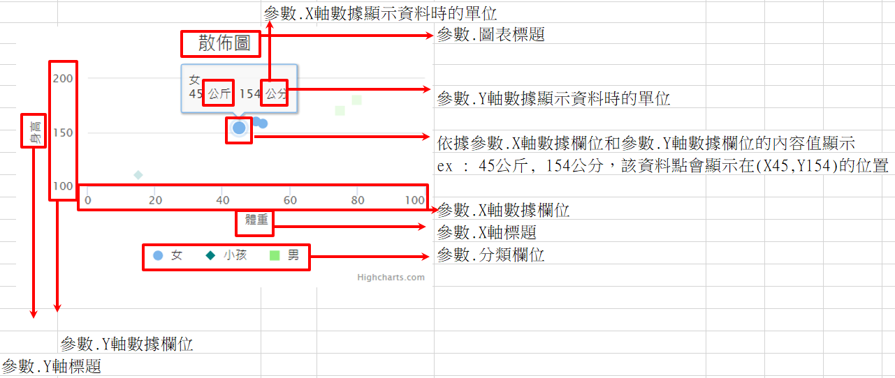

### 
散佈圖 <path>(物件類別\圖表\圖表類型)

| 參數名稱        | 可空白	  	  | 來源型態	   | 參數說明	    |
|:------------- |:------------- |:------------- |:------------- |
| 圖表標題	| V	| 多語詞庫	| 顯示圖表的標題| 
| X軸標題	| 	| 多語詞庫	| X軸顯示標題| 
| Y軸標題	| 	| 多語詞庫	| Y軸顯示標題| 
| 來源邏輯表格	| 	| 檢視表	| 顯示圖表的資料來源| 
| 來源過濾運算式	| V	| 條件式| 	顯示圖表的資料來源過濾式| 
| 分類欄位	| 	| 查表欄位	| 分群用欄位| 
| X軸數據欄位	| 	| 查表欄位	| X軸數據欄位| 
| Y軸數據欄位	| V| 	查表欄位| 	Y軸數據欄位| 
| X軸數據顯示資料時的單位	| V 	| 多語詞庫	| X軸數據顯示單位| 
| Y軸數據顯示資料時的單位	| V 	| 多語詞庫	| Y軸數據顯示單位| 
| 標題替換字1	| V| 	運算式	| 替換圖表標題裡%P1的值| 
| 標題替換字2	| V| 	運算式	| 替換圖表標題裡%P2的值| 

* 範例說明

    散佈圖設定

    | 參數名稱	| 來源型態	| 來源內容| 
    |:------------- |:------------- |:------------- |
    | 圖表標題	| 多語詞庫	| 散佈圖| 
    | X軸標題	| 多語詞庫	| 體重| 
    | Y軸標題	| 多語詞庫	| 身高| 
    | 來源邏輯表格| 檢視表	| 元件加註-嵌入物件_散佈圖| 
    | 分類欄位		| 查表欄位	| 分類| 
    | Y軸數據欄位		| 查表欄位	| 金額| 
    | Y軸數據欄位		| 查表欄位	| 金額| 
    | Y軸數據欄位		| 查表欄位	| 金額| 
    | Y軸數據計算方式	| 選項	| Avg| 
    | 是否在線圖上顯示資料值	| 選項	| TRUE| 

    檢視表.元件加註-嵌入物件_散佈圖

    | 分類	| 體重	| 金額	|
    |:------------- |:------------- |:------------- |
    | 女	| 45	| 154| 
    | 女	| 50	| 160| 
    | 女	| 52	| 158| 
    | 男	| 75	| 170| 
    | 男	| 80	| 180| 
    | 小孩	| 15	| 110| 

    依據設定配合資料，圖表元件顯示結果如下圖所示

    