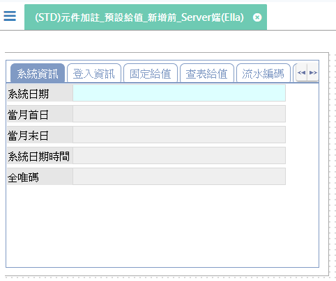
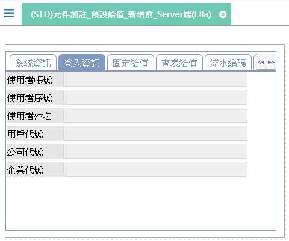
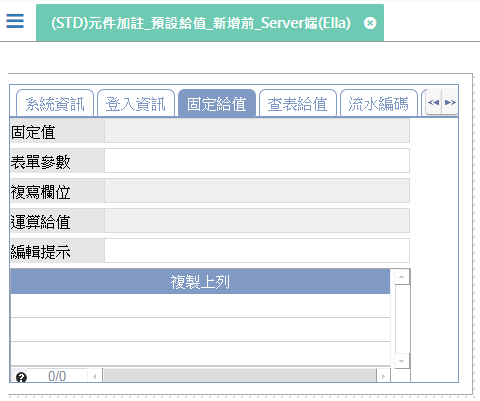
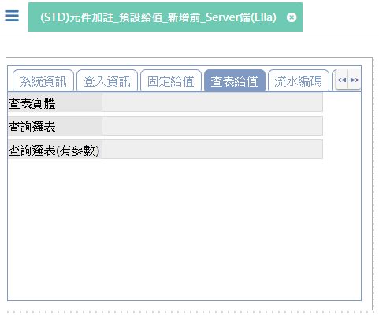
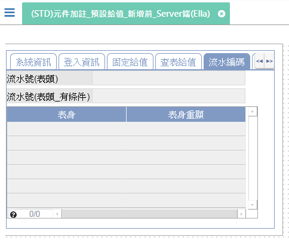
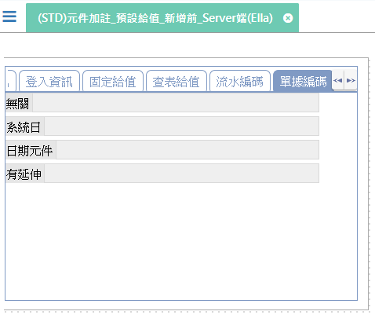

[上一頁]({back})
# (STD)元件加註_預設給值_新增前_Server端(Ella)

## 元件說明
* 頁簽.系統資訊
    * 系統日期：產生系統日期。
    * 當月首日：取得系統日期的當月第一天。
    * 當月末日：取得系統日期的當月最後一天。
    * 系統日期時間：產生系統日期時間。
    * 全唯碼：產生隨機的全唯碼。

* 登入資訊
    * 使用者帳號：產生登入人員的帳號
    * 使用者序號：產生登入人員的序號
    * 使用者姓名：產生登入人員的姓名
    * 用戶代號：產生登入人員的員工代號
    * 公司代號：產生登入人員的公司序號
    * 企業代號：產生登入人員的企業代碼

* 固定給值
    * 固定值：產生"固定值~測試~"
    * 表單參數：取得前單傳入的參數內容值(內容值：前單傳入的)
    * 複寫欄位：產生"元件.固定值"相同的內容值
    * 運算給值：函數.取得登入企業名稱 + 函數.系統日期時間
    * 編輯提示：<rte>新增狀態</rte>下(內容值：多語資料內容)
    * 複製上列：新增一筆資料時自動產生剛剛駐留的那一筆資料內容

* 查表給值
    * 查表實體：依登入人員序號查詢實體.使用者設定回傳欄位.員工代號
    * 查表邏表：依登入人員序號查詢邏表.使用者設定回傳欄位.員工代號
    * 查表邏表(有參數)：依登入人員序號查詢邏表.使用者設定回傳欄位.員工代號

* 流水編碼
    * 流水號(表頭)：依序給流水號
    * 流水號(表頭_有條件)：依序給流水號(條件:流水號 <= 固定值.00Z)
    * 表身：依照不同的主檔區給予流水號
    * 表身重顯：依照不同的主檔區給予流水號(即時更新)

* 單據編碼
    * 無關：依`照編碼格式`(KKK-DRE9999)產生編碼流水號。
        * KKK：表單欄位.固定值(取三碼)。
        * -：固定內容。
        * DRE：固定內容。
        * 9：A ~ Z。
        * 9：0 ~ 9 + A ~ Z (不含 I、O、Z)。
        * 9：0 ~ 9 + A ~ Z。
        * 9：0 ~ 9。
    * 系統日：依`照編碼格式`(YYYY-MM-DD(WW)-9)產生編碼流水號。
        * YYYY：`日期基礎`=`系統日期`，產生系統日期的年度4碼。
        * -：固定內容。
        * MM：`日期基礎`=`系統日期`，產生系統日期的月份2碼。
        * DD：`日期基礎`=`系統日期`，產生系統日期的日期2碼。
        * (：
        * WW：`日期基礎`=`系統日期`，產生系統日期的週次2碼。
        * )：固定內容。
        * -：固定內容。
        * 9：0 ~ 9。
    * 日期元件：依`照編碼格式`(YYYY-MM-DD-99)產生編碼流水號。
        * YYYY：`日期基礎`=`日期元件`，產生元件.當月末日的年度4碼。
        * -：固定內容。
        * MM：`日期基礎`=`日期元件`，產生元件.當月末日的月份2碼。
        * -：固定內容。
        * DD：`日期基礎`=`日期元件`，產生元件.當月末日的日期2碼。
        * -：固定內容。
        * 99：0 ~ 9。
    * 有延伸：不同的元件.表單參數，依照`編碼格式`(PNE999)產生編碼流水號。
        * PNE：固定內容。
        * 999：0 ~ 9。