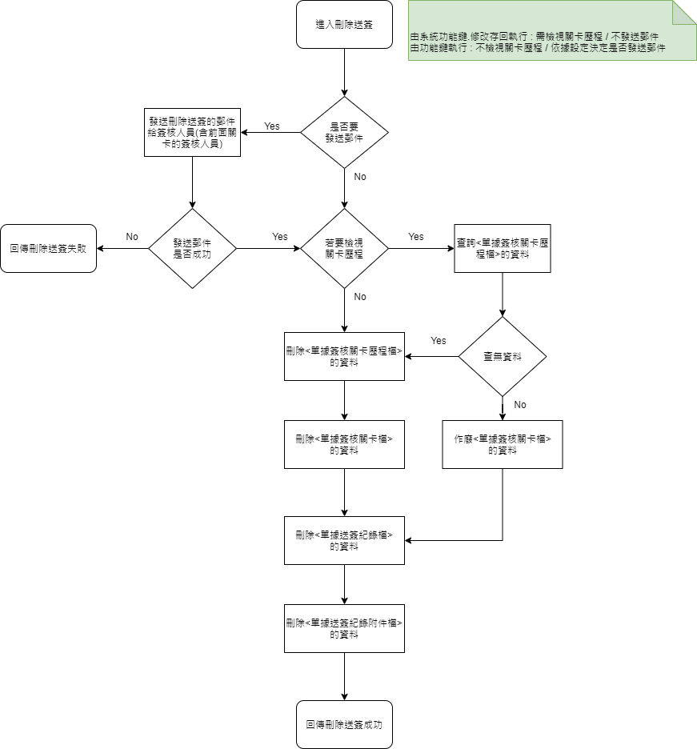
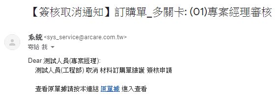

### 
功能說明

* 將已送出的簽核紀錄刪除，並通知簽核人員。須執行的動作如下
    * 依傳入參數.發送郵件決定是否發送刪除送簽的郵件給簽核人員(含前面關卡的簽核人員)
    * 依傳入參數.檢視關卡歷程決定是否查詢【單據簽核關卡歷程檔】的資料。若需查詢且有資料則僅作廢【單據簽核關卡檔】的資料，反之就刪除【單據簽核關卡歷程檔】以及【單據簽核關卡檔】的資料。
    * 刪除【單據送簽紀錄檔】的資料
    * 刪除【單據送簽紀錄附件檔】的資料
* 目前的執行時機如下
    * 系統功能鍵.修改存回執行 : 須檢視簽核關卡歷程且不須發送郵件通知
    * 功能鍵執行 : 不須檢視簽核關卡歷程且依據設定決定是否郵件通知

### 
功能流程

### 
功能範例畫面

