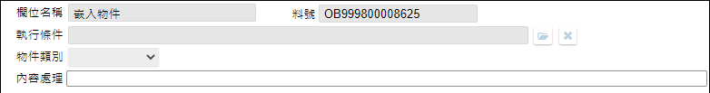

## 
版面相關

* 版面 
    ![pic][image_OADisplayEmbed]
* [版面資訊通則][link_ruleother1]
		
## 
動作說明

* 依規格關聯-主畫面 結構清單駐留元件及指定加註條件, 顯示本單內容
* 依規格關聯-主畫面 工具列.編修鍵, 進入本單的編輯模式
* 參照 [單據異動資料按鍵操作通則][link_rulebutton2]
    * 下列欄位, 除規格說明中有額外說明, 否則所有欄位在瀏覽狀態: 除能 ; 編輯狀態: 致能

## 
欄位說明

* 
主畫面區塊

    
    * `(1)欄位名稱`
        * 用途說明
        * 規格說明
            * 參照 [使用多語詞庫通則][link_ruledialog2], 回傳:元件多語內容並顯示
    * `(2)料號`
        * 用途說明
        * 規格說明
            * 顯示前單傳入的元件料號
    * `(3)執行條件`
        * 用途說明
        * 規格說明
            * 參照 [操作條件式通則][link_ruledialog1], 回傳並顯示: 條件說明
    * `(4)物件類別`
        * 用途說明
        * 規格說明
            * 選項 網頁/地圖/影片/圖表/系統內表單/檔案櫃圖檔/檔案容器控制/行事曆
                * 依據表單類型顯示不同選項
                    * [新增表單/報表][link_AddFormReport_fieldbreak1]`設計類型`=STD, 選項 網頁/地圖/影片/圖表/系統內表單/檔案櫃圖檔
                    * [新增表單/報表][link_AddFormReport_fieldbreak1]`設計類型`=RWD, 選項 網頁/地圖/影片/圖表/系統內表單/檔案櫃圖檔/檔案容器控制/行事曆
                    * [新增表單/報表][link_AddFormReport_fieldbreak1]`設計類型`=APP, 選項 網頁/檔案容器控制/行事曆
    * `(5)內容處理`
        * 用途說明
        * 規格說明
            * 依`(4)物件類別`顯示設定頁面
                * 選項為 [網頁](WebPage)
                * 選項為 [地圖](Map)
                * 選項為 [影片](Movie)
                * 選項為 [圖表](Chart)
                * 選項為 [系統內表單](InSystemForm)
                * 選項為 [檔案櫃圖檔](FileCabinetImage)
                * 選項為 [檔案容器控制](FileContainerControl)
                * 選項為 [行事曆](Calendar)

## 
其它

* [MAE加註儲存通則][link_ruleother5]

<!-- 圖片 -->
[image_OADisplayEmbed]:attachment/OADisplayEmbed.png
[image_OADisplayEmbed_block1]:attachment/fieldbreak1_STD.png

<!-- 超連結 -->
[link_ruleother1]:../RulesOther/README#ruleother1 "共用通則_其它/版面資訊通則"
[link_rulebutton2]:../RulesButton/README#rulebutton2 "共用通則_按鍵/單據異動資料按鍵操作通則"
[link_AddFormReport_fieldbreak1]:../AddFormReport/README#fieldbreak1 "新增表單/報表/區塊1"
[link_ruledialog1]:../RulesDialog/README#ruledialog1 "共用通則_開啟單據/操作條件式通則"
[link_ruledialog2]:../RulesDialog/README#ruledialog2 "共用通則_開啟單據/使用多語詞庫通則"
[link_ruleother5]:../RulesOther/README#ruleother5 "共用通則_其它/MAE加註儲存通則"