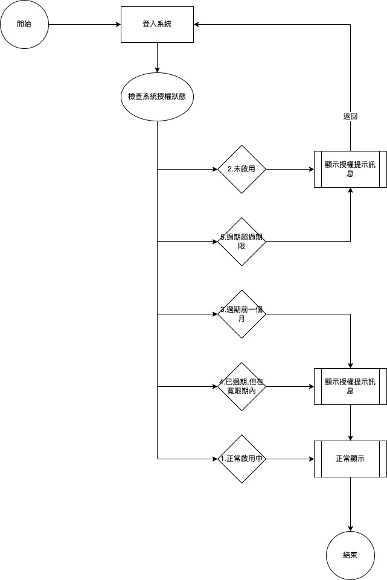

# 授權管理

* #### 登入站台
  * 登入站台時會檢查站台的授權狀態
    1. 正常啟用中

      正常顯示

    2. 未啟用

      顯示授權提示訊息且返回站台登入畫面

    3. 過期前一個月

      顯示授權提示訊息且正常顯示

    4. 已過期,但在寬限期內

      顯示授權提示訊息且正常顯示

    5. 過期超過期限

      顯示授權提示訊息且返回站台登入畫面

  * 流程圖

    

* #### 登入系統
  * 在登入系統時會檢查系統狀態並顯示相關訊息
    1. 正常啟用中
          
      正常顯示

    2. 未啟用
          
      顯示授權提示訊息且返回系統登入畫面

    3. 過期前一個月
          
      顯示授權提示訊息且正常顯示
          
    4. 已過期,但在寬限期內
          
      顯示授權提示訊息且正常顯示
          
    5. 過期超過期限
          
      顯示授權提示訊息且返回系統登入畫面

  * 流程圖

    

* #### 背景返回前景
  * 在背景返回前景時會先檢查授權狀態
    * 當授權狀態=失效時
      * 顯示錯誤訊息且返回站台登入畫面
    * 當授權狀態=有效時
      * 返回前景
  * 流程圖

    

* #### 另開他單
  * 在開啟新表單之前會先檢查授權狀態
    * 當授權狀態=失效時
      * 顯示錯誤訊息且返回站台登入畫面"
    * 當授權狀態=有效時
      * 執行開啟新表單
  * 流程圖

    

* 完整網站規劃連結 : [授權中心網站](../../../LICENSE/README.md)
