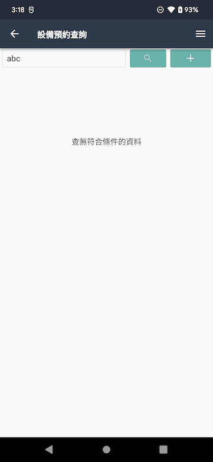
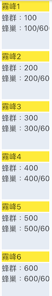
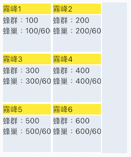
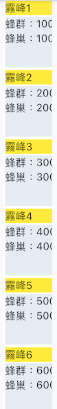
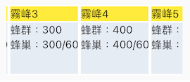
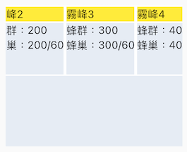
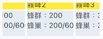
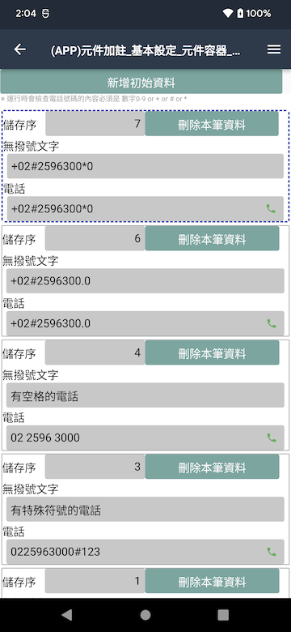
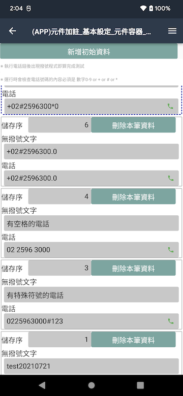

# 元件類型-元件容器

* ## Web支援版本
  
      8.10.2

* ### APP 支援版本

      008.010.002004 以上(含)

  008.010.002022 以上(含)

  * [滑動區域](../../UPDATE/ITEM_10/MAE/README.md)

* #### 元件代碼

      wCtnr

* #### 相依性

      獨立元件

* #### 版面相關

  * 元件寬高
    * 高度
      * 區塊模式=單列式
        * 高度=變動高度
          * 元件的高度依`區塊區`縮放
      * 區塊模式=磚塊式
        * 高度=固定高度
        * 高度=變動高度
          * 元件的高度依`區塊區`縮放
    * 寬度(%)
          不含 `外邊距`的左邊距/右邊距：(單元樣式/外邊距/(左邊距/右邊距))
      * 區塊模式=單列式
        * 區塊寬度=元件寬度
      * 區塊模式=磚塊式
        * 磚塊為固定寬度
        * 滑動方向=上下滑動
          * 超過元件寬度時折行
    * 當裝置的大小不同時，可能導致元件寬高會改變
  * 區塊寬高
    * 高度
      * 區塊模式=單列式
        * 區塊為變動高度
      * 區塊模式=磚塊式
        * 區塊為固定高度
    * 寬度
      * 區塊模式=單列式
        * 區塊寬度=元件寬度
      * 區塊模式=磚塊式
        * 區塊為固定寬度
  * 滑動方向
    * 上下滑動
      * 區塊模式=磚塊式
        * 超過元件寬度時折行
    * 左右滑動
      * 固定只顯示一行
      * 區塊模式=磚塊式
        * 當 元件高度=固定高度 且 小於區塊高度時，可以`上下滑動`
  * 容器內無資料時
    * 顯示"查無符合條件的資料"
    * 高度依裝置畫面的1/3來顯示，若不足250 pixel則以250 pixel來顯示
  * 資料間距
    * 套用`區塊樣式`的外邊距

* #### 元件樣式

  * [致能(Apps_Enable)](../General/style.md#致能Apps_Enable)

    * 區塊模式=單列式/磚塊式
      * 不支援 ~`內容`~

  * [區塊(Apps_Block)](../General/style.md#區塊Apps_Block)

    * 區塊模式=單列式/磚塊式
      * 不支援 ~`內容`~
      * 不支援 ~`光棒(lightBar)`~
    * `注意`
      * 若元件為`固定高度`且`元件高度 > 手機畫面`時，當元件畫面佔滿`螢幕畫面(表單可顯示區域)`時將`無法滑動`表單層

  * [行樣式(Row)](../General/style.md#致能Apps_Enable)

    * 行致能(Apps_Enable)
      * 不支援 ~`內容`~
      * 不支援 ~`框線`~
      * 邊界
        * 不支援 ~`外邊距`~
      * 不支援  ~`光棒(lightBar)`~

  * [列樣式(Column)](../General/style.md#致能Apps_Enable)

    * 行致能(Apps_Enable)

      * 不支援 ~`內容`~
      * 不支援 ~`框線`~
      * 邊界
        * 不支援 ~`外邊距`~
      * 不支援 ~`光棒(lightBar)`~

  * 預設樣式

    * 區塊模式=單列式/磚塊式
      * 元件樣式
        * 背景顏色＝[0xFFFFFFFF]
        * 光棒
          * 背景顏色＝[0xFFFFFFFF]
            * `無區塊樣式時`
          * 邊框 顏色=[0xFF3F51B5]，線條＝虛線，圓角=1，寬度＝2
      * 區塊樣式
        * 背景
          * 顏色=[0xFFFFFFFF]
        * 邊框
          * 顏色=[0xFF9E9E9E]，線條＝實線，圓角=1，寬度＝1
        * 內邊距
          * 左=上=右=下=0
        * 外邊距
          * 左=上=右=下=2
      * 行樣式
        * 無
      * 列樣式
        * 無

* #### 加註

  * [x] [基本設定](../Addition/Component/basicSettings)
  * [ ] [預設給值](../Addition/Component/defaultValue)
  * [x] [更新給值](../Addition/Component/updateValue)
  * [ ] [被動更新](../Addition/Component/passiveUpdate)
  * [ ] [編輯能力](../Addition/Component/editing)
  * [x] [顯示設定](../Addition/Component/display)
            顯示設定-背景色，僅套用至區塊
  * [ ] [檢控限制](../Addition/Component/prosecutionRestrictions)
  * [ ] [嵌入物件](../Addition/Component/embedded)
  * [ ] [選項清單](../Addition/Component/optionalList)

* #### 行為

  * 支援的子元件類型
        註：皆強制為僅供顯示
    * 文字標題
    * 文字方塊
    * 多行文字
    * 下拉選項
    * 清單選項
    * 按鈕群組
    * 按鈕選項
    * 核取方塊
    * 圖片
    * 框線
    * 畫布
  * 受權限保護元件：(Trac #7477)
    * [ ] 支援
    * [x] 不支援
  * 對應檔區：
    * 表單元件/基本設定/存在檔區
  * 對應欄位：
    * [ ] 支援
    * [x] 不支援
  * 顯示巨集：
    * [ ] 支援
    * [x] 不支援
  * 模版：
    * [ ] 支援
    * [x] 不支援
  * 提示：
    * [ ] 支援
    * [x] 不支援
  * 錯誤顯示：
    * [ ] 支援
    * [x] 不支援
  * 資料過濾：
    * [ ] 支援
    * [x] 不支援
  * 資料搜尋：
    * [ ] 支援
    * [x] 不支援
  * 檔區每次下載筆數：
    * 表單版面
      * 滑動方向=上下滑動
        * 50筆
      * 滑動方向=左右滑動
        * 10筆
  * 編輯模式：不支援
  * 瀏覧模式：
    * 樣式
      * 顯示行樣式`(行樣式會包住列樣式)`
      * 顯示列樣式
      * 顯示區塊樣式`(區塊樣式會包住行樣式)`
      * 駐留筆
        * 顯示光棒樣式`(光棒樣式會取代區塊樣式，不包含內間距/外邊距)`
    * 顯示樣式
      * 表單元件/顯示設定/顏色(背景色)
        * 僅套用至區塊
  * 預設載入筆數:
    * 表單版面
      * 滑動方向=上下滑動
        * 先載入50筆。若後面還有時向下滑到最底時再往上滑動會再載入50筆，當前會保留100筆資料，超過部份不保留。
      * 滑動方向=左右滑動：
        * 先載入10筆。若後面還有時向左滑到底再往左滑動會再載入10筆，當前會保留20筆資料，超過部份不保留。
  * 開單隱藏：
    * [ ] 支援
    * [x] 不支援
  * 資料隱藏：
    * [ ] 支援
    * [x] 不支援
  * 元件隱藏：
    * [x] 支援
    * [ ] 不支援
  * 元件除能：
    * [ ] 支援
    * [x] 不支援
  * 元件駐留：
    * [ ] 支援
    * [x] 不支援
  * 操作：
    * 點擊 (記錄移動)
  * 檔區更新
    * 整個檔區：(按鍵/基本設定/重顯網格/資料行更新方式＝全部記錄)
      * 重顯畫面
            駐留筆不存在時，會停留在上一筆或下一筆
    * 駐留筆：(按鍵/基本設定/重顯網格/資料行更新方式＝駐留筆)
      * 駐留筆不存在時
            更新`整個檔區`
      * 駐留筆存在時
            刷新駐留筆資料

* #### 預覧畫面

  * 元件示意圖
    * 無資料時顯示"查無符合條件的資料"

      

    * 類型＝磚塊式
      * 滑動方向＝上下滑動

        

        * 元件寬度 > 區塊寬度

          

        * 元件寬度 < 區塊寬度

          

      * 滑動方向＝左右滑動

        

        * 元件高度 = 固定高度
          * 元件高度 > 區塊高度

            

          * 元件高度 < 區塊高度 => 可上下滑動

            

    * 類型=單列式
      * 滑動區域=全螢幕

        

      * 滑動區域=元件容器

        

* #### 作業流程
