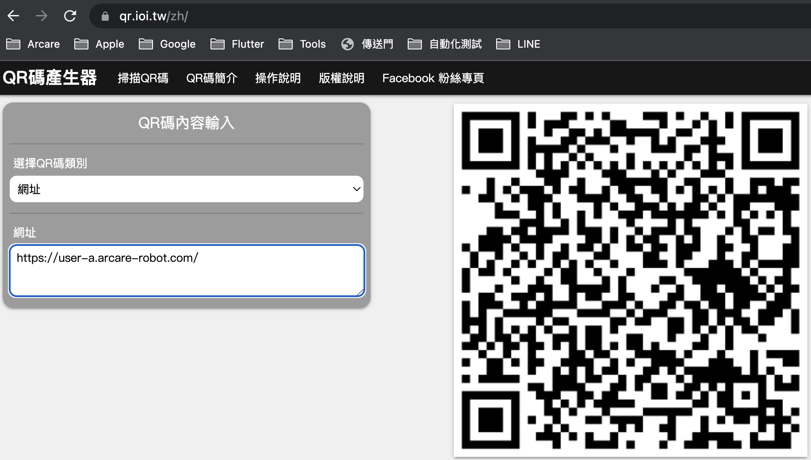

# 掃瞄方式

* ## 網址掃瞄
    1. QRCode類別為網址
    2. 資料為字串

* #### 參考畫面

    

* ## 伺服器資訊掃瞄
    1. QRCode類別為純文字
    2. 資料為json格式

            {"server":"https://user-a.arcare-robot.com/","server name":"user-a","leading":true}

        格式說明如下
       1. key=server 伺服器路徑(必要)，未包含時不作任何處理
       2. key=server name 伺服器名稱(非必要)
       3. key=leading 設定為主要伺服器(非必要)，當有此項設定時，會直接新增伺服器並直接設定為主要伺服器
          
      
* #### 參考畫面

    

* ## 打樣資訊掃瞄
    1. QRCode類別為純文字
    2. 資料為json格式
    3. 圖檔由IDE產生

* #### 參考畫面

    
