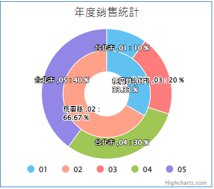

### 
環圈圖 <path>(物件類別\圖表\圖表類型)</path>

| 參數名稱        | 可空白	  	  | 來源型態	   | 參數說明	    |
|:------------- |:------------- |:------------- |:------------- |
| 圖表標題	| V	| 多語詞庫	| 顯示圖表的標題|
| 來源邏輯表格	| 	| 檢視表| 	顯示圖表的資料來源| 
| 來源過濾運算式| 	V	| 條件式	| 顯示圖表的資料來源過濾式| 
| 環圈資料筆數  | V | 數字 | 環圈的最大圈數,預設值=10 |
| 數列名稱欄位  |  | 查表欄位  | 環圈的數列名稱欄位 |
| 是否顯示數列名稱  |  | 邏輯  | 在資料中是否顯示數列名稱 |
| 是否在線圖上顯示資料值| 		| 選項	| TRUE / FALSE| 
| Y軸分類欄位	| 	| 查表欄位	| 每一個環圈中的分類欄位| 
| Y軸數據欄位	| 	| 查表欄位	| 每一個環圈中的分類欄位對應的數值| 
| 環圈擴張方式| 	| 	選項	| 1.往內長 / 2.往外長| 
| 標題替換字1	| V	| 運算式	| 替換圖表標題裡%P1的值| 
| 標題替換字2	| V	| 運算式	| 替換圖表標題裡%P2的值| 

* 範例說明

    環圈圖設定

    | 參數名稱	| 來源型態	| 來源內容| 
    |:------------- |:------------- |:------------- |
    | 圖表標題	| 多語詞庫	| 年度銷售統計| 
    | 來源邏輯表格| 檢視表	| 圖表元件_表格| 
    | 來源過濾運算式	| 條件式	| 欄位.年度=2021| 
    | 環圈資料筆數	| 數字	| 2| 
    | 數列名稱欄位	| 查表欄位	| 地區| 
    | 是否顯示數列名稱	| 邏輯	| TRUE| 
    | 是否在線圖上顯示資料值	| 邏輯	| TRUE|
    | 是否在線圖上顯示資料值	| 選項	| TRUE| 
    | Y軸分類欄位		| 查表欄位	| 地區| 
    | Y軸數據欄位		| 查表欄位	| 金額| 
    | 環圈擴張方式	| 選項	| 往內長| 

    檢視表.圖表元件_表格

    | 地區	| 年度	| 月份	| 數量| 
    |:------------- |:------------- |:------------- |:------------- |
    | 台北市	| 2021	| 01	| 100| 
    | 台北市	| 2021	| 03    | 200 | 	
    | 台北市	| 2021	| 04    | 300 | 	
    | 台北市	| 2021	| 05	| 400 | 
    | 桃園縣	| 2021	| 01	| 50  | 
    | 桃園縣	| 2021	| 01	| 100 | 
    | 新北市	| 2021	| 01	| 150 | 
    | 新北市	| 2021	| 02	| 100 | 
    | 新北市	| 2021	| 03	| 100 | 
    | 新北市	| 2021	| 04	| 100 | 
    | 新北市	| 2021	| 05	| 100 | 

    依據設定配合資料，圖表元件顯示結果如下圖所示

    