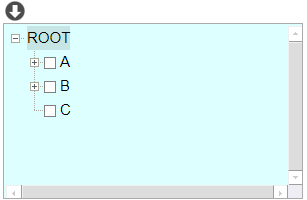
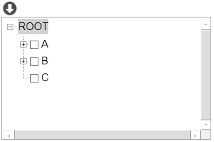
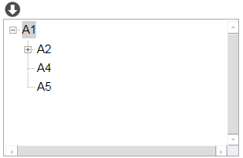
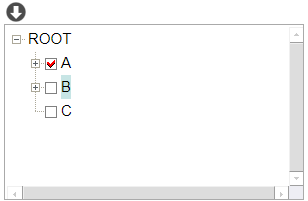
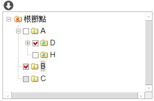
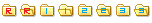

# 樹元件

## 
版面相關_STD表單(傳統表單)

* 元件位置寬高				
    * X軸 : (px)			
    * Y軸 : (px)			
    * 寬度 : (px)			
    * 高度 : (px)			
* [標題](../common/README.md#std-ctrl_title)
* 套用樣式				
    * 支援狀態 : [( [表單設計類型] = [傳統表單] 且 [元件類型代碼] = [wTree] )]()
    * 元件構成

        

            

                
元件

                
標題區
                

                

                    
內容區

                    

                        
框線

                        

                        
內間距 / 底色

                            
內容
                            
                   
                        
            
                    

                

            

        

        註.以 [ 標題位置:左 ] 為例

    * 光棒 : <駐留節點>會套上光棒樣式        
        * 駐留樣式

            
        * 未駐留樣式            

                    

## 
對應檔區

* IDE : 元件加註_基本設定_存在檔區

## 
對應欄位

* IDE : 元件加註_基本設定_檢視表對應欄位
* 可不設
* 用途 : 節點顯示的內容。
* 支援欄位型態
    * 文字

## 
顯示巨集

* IDE
    * 元件加註_顯示設定_內容處理_欄位組合
    * 元件加註_樹狀控制_指定顯示
* 用途 : 節點顯示的內容。
* 支援欄位型態
    * 文字

## 
提示

* IDE : 元件加註_基本設定_欄位提示訊息

## 
瀏覽模式

* 樣式
    * 呈現
        * 無checkbox / 無節點圖示

            

        * 有checkbox

            

        * 有checkbox / 有節點圖示

            

    * checkbox
        * IDE : 元件加註_樹狀控制_資料控制_致能勾選
        * 圖示

             致能，未勾選

             致能，已勾選

             除能，未勾選

             除能，已勾選
        * 致能條件
            * IDE
                * 元件加註_樹狀控制_資料控制_致能勾選_限制條件
    * 
節點圖示

        * IDE 
            * 元件加註_樹狀控制_外觀_節點圖示
        * 每組2個圖示(未駐留圖示,駐留圖示)。每個圖示寬高固定為w19 * h23。
        * 第一組固定為根節點使用。

        * ex1.

            