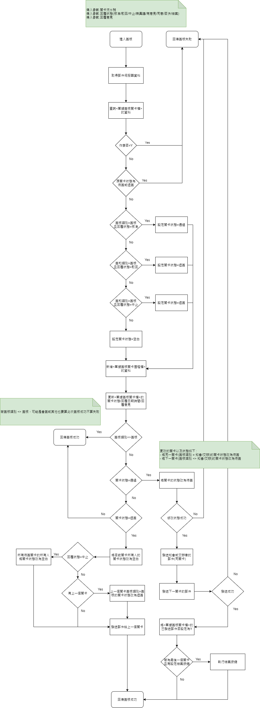

### 
功能說明

* 針對目前關卡進行狀態的回覆，狀態一共有以下類型 :
    * 核准 : 表示該關卡的狀態為【通過】，往下一關卡進行，須執行以下動作
        * 新增【單據簽核關卡歷程檔】的資料
        * 更新【單據簽核關卡檔】的關卡狀態=通過,回覆日期時間=現在以及回覆意見
        * 將同一關卡(簽核類別 = 知會/交辦)的關卡狀態改為待簽並發送郵件通知
        * 將下一關卡(簽核類別 <> 知會/交辦)的關卡狀態改為待簽並發送郵件通知
        * 若該關卡為最後一關，且有設定結案按鍵，則執行結案按鍵
    * 駁回 : 表示該關卡的狀態為【退簽】，須執行以下動作
        * 新增【單據簽核關卡歷程檔】的資料
        * 更新【單據簽核關卡檔】的關卡狀態=退簽,回覆日期時間=現在以及回覆意見
        * 將同一關卡所有人的關卡狀態改為空白
        * 若有上一關卡，則將上一關卡簽核類別=簽核的關卡狀態改為退簽
        * 發送郵件給上一個關卡
    * 中止
        * 新增【單據簽核關卡歷程檔】的資料
        * 更新【單據簽核關卡檔】的關卡狀態=退簽,回覆日期時間=現在以及回覆意見
        * 將同一關卡所有人的關卡狀態改為空白
        * 所有關卡的所有人都將關卡狀態改為空白
        * 發送郵件給上一個關卡
    * 無異議
        * 新增【單據簽核關卡歷程檔】的資料
        * 更新【單據簽核關卡檔】的關卡狀態=空白,回覆日期時間=現在以及回覆意見
    * 有意見
        * 同狀態.無異議
    * 同意
        * 同狀態.無異議
    * 否決
        * 同狀態.無異議
    * 結案
        * 同狀態.無異議

### 
功能流程

