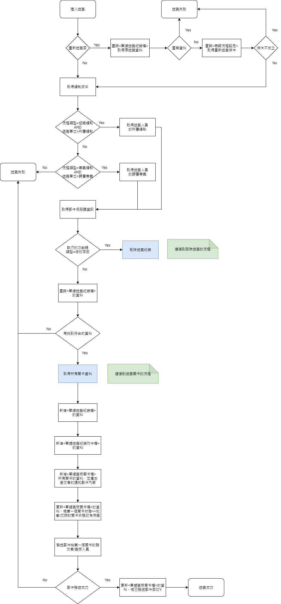
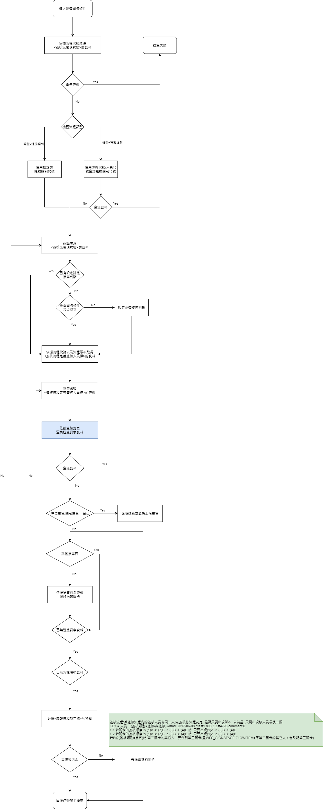
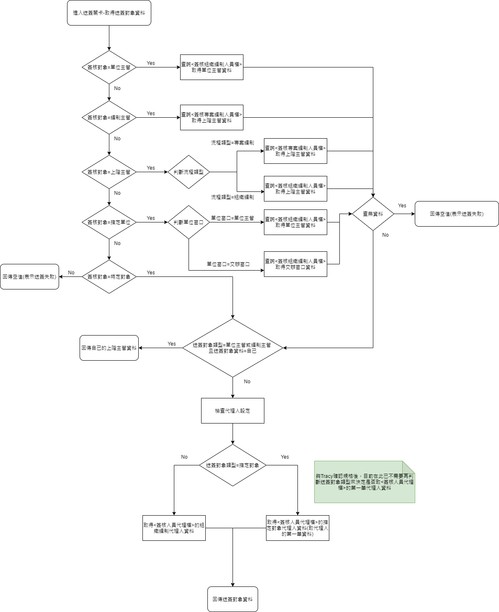

### 
功能說明

* 執行簽核流程的產生，會依據【簽核模組】的設定產生簽核關卡。相關設定條件如下
    * 需判斷【簽核模組】流程類型是組織編制或專案編制查詢相對應的簽核人員
    * 當由系統功能鍵.修改存回執行送簽功能時，需額外執行刪除送簽的動作，等同於重新產生送簽。
    * 依據編制資料自動產生簽核流程關卡，並已發送郵件給第一個關卡的簽核人員

### 
功能流程

* 取得所有送簽關卡流程

* 取得送簽對象流程
