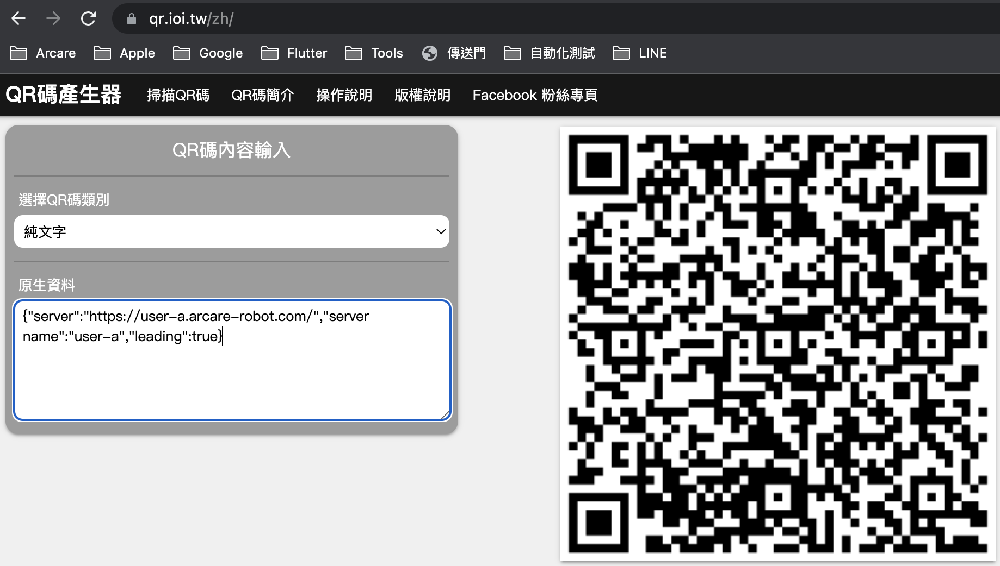

### 
規劃人員

* Andy

### 
規劃日期

* 2023/03/31

### 
TRAC

* #9223

### 
需求展開

  * 新增伺服器清單掃瞄QRCode種類

    1. 原掃瞄網址的部份增加為掃瞄文字
    2. QRCode類別為純文字
    3. 資料為json格式

            {"server":"https://user-a.arcare-robot.com/","server name":"user-a","leading":true}

        格式說明如下
       1. key=server 伺服器路徑(必要)，未包含時不作任何處理
       2. key=server name 伺服器名稱(非必要)
       3. key=leading 設定為主要伺服器(非必要)，當有此項設定時，會直接新增伺服器並直接設定為主要伺服器
          
      
* #### 參考畫面

    

<!-- 超連結 -->