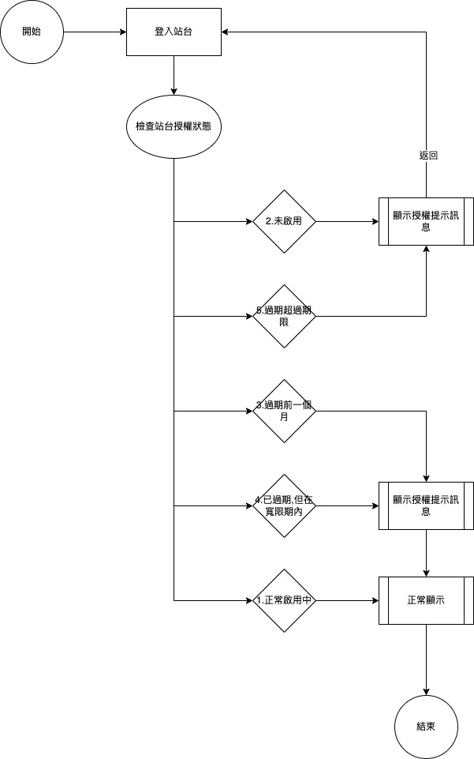
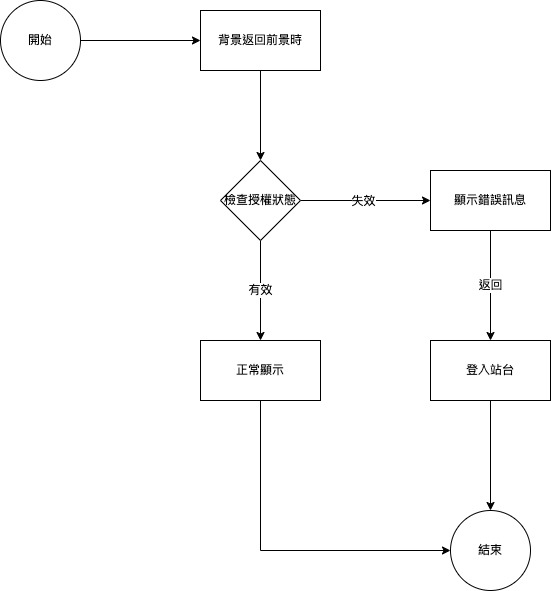

### 
規劃人員

* Andy

### 
規劃日期

* 2023/04/21

### 
TRAC

* #9213

### 
需求展開

  * 配合授權中心進行授權管理
    * 顯示時機如下
      * 登入站台時
        在登入站台時會檢查站台狀態並顯示相關訊息

        1. 正常啟用中

          正常顯示

        2. 未啟用

          顯示授權提示訊息且返回站台登入畫面

        3. 過期前一個月

          顯示授權提示訊息且正常顯示

        4. 已過期,但在寬限期內

          顯示授權提示訊息且正常顯示

        5.  過期超過期限

            顯示授權提示訊息且返回站台登入畫面

        * 流程圖

          
        
      * 登入系統時
        * 在登入系統時會檢查系統狀態並顯示相關訊息
            
          1. 正常啟用中
          
            正常顯示

          2. 未啟用
          
            顯示授權提示訊息且返回系統登入畫面

          3. 過期前一個月
          
            顯示授權提示訊息且正常顯示
          
          4. 已過期,但在寬限期內
          
            顯示授權提示訊息且正常顯示
          
          5. 過期超過期限
          
            顯示授權提示訊息且返回系統登入畫面

        * 流程圖

          
      
      * 當背景返回前景時
        * 在背景返回前景時會先檢查授權狀態
          * 當授權狀態=失效時
            * 顯示錯誤訊息且返回站台登入畫面
          * 當授權狀態=有效時
            * 返回前景
        * 流程圖

          
      
      * 當開啟新表單時
        * 在開啟新表單之前會先檢查授權狀態
          * 當授權狀態=失效時
            * 顯示錯誤訊息且返回站台登入畫面"
          * 當授權狀態=有效時
            * 執行開啟新表單
        * 流程圖

          
          
    
  * 完整網站規劃連結 : [授權中心網站](../../../LICENSE/README.md)

<!-- 超連結 -->