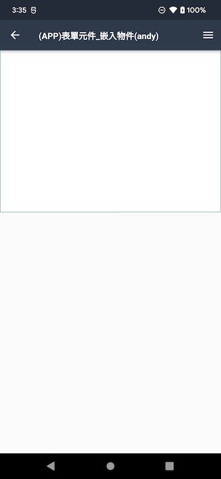

#### 
功能項目名稱

  *  MAE框架規格異動

### 
規劃人員

* Andy

#### 
版本記錄

  |日期|版本|備註|
  |---|---|---|
  |2022/04/19|v1|初始化|

### 
TRAC

* [#8983](http://trac.uneec.com/trac/neco/ticket/8983)
* [#9002](http://trac.uneec.com/trac/neco/ticket/9002)

### 
規格說明

  * 需求展開
    * 1. MAE 設定主要裝置UI/訊息修改
      * 取消說明按鈕
      * 主要裝置訊息顯示原本說明內的訊息
      * 同步顯示 側拉/打樣/無主要裝置時的登入
      
        

    * 2. 訊息盒
      * UI修改
        * title 改為圖＋大號字
        * title 靠左
    
        

      * 按鈕顏色統一藍色
    
        

      * 訊息盒訊息修改
    * 3. [基本設定][basicSettings]
      * 必要項
        * 預設提示訊息
          * 為編輯狀態時要有hint文字"請輸入"
      * 撥號功能
        * 當空資料時顯示"空資料無法撥號。"。
        * 當有資料時，去除0~9+#*之外的資料，若去除後無資料則顯示"電話號碼不符合規則，無法撥打電話。"
    * 4. [容器元件][container]
      * 無資料時的提示訊息="查無符合條件的資料"
      * 顏色同hint
    * 5. [行事曆][calendar]
      * 新增"今日"按鈕
    * 6. App Icon計數服務
      * 預設=關閉
        * 在計數服務關閉時不更新(由OS系統更新)

      

    * 7. APP側拉選單
      * 版本
        * 調整顯示位置
      * 登出鍵
        * 調整顯示位置
      
        

    * 8. [檔案容器][fileContainer]
      * 在瀏覽狀態時若無資料不顯示工具列
    
      

<!-- 連結 -->
[basicSettings]:../../../MAE/Addition/Component/basicSettings.md "基本設定"
[container]:../../../MAE/Component/container.md "容器元件"
[calendar]:../../../MAE/Component/calendar.md "行事曆"
[fileContainer]:../../../MAE/Component/fileContainer.md "檔案容器"
