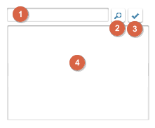
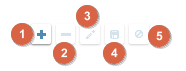

## 
搜尋區塊操作通則

* (2)搜尋鍵
    * 用途說明
    * 規格說明
		* 以 Like %(1)關鍵字% 的語法, 比對 專案語系下的 文字內容(language_value)
		* 載入符合條件的記錄, 並以 文字內容 由小到大, 升冪排序
* (3)勾選鍵
    * 用途說明
    * 規格說明
		* 由其它單據開啟時顯示，其餘隱藏
		* 須駐留記錄清單上的記錄內容，才致能
		* 由其它單據開啟時，且它單為瀏覽模式，則除能
* (4)記錄清單
    * 用途說明
    * 規格說明
		* 以移動記錄, 顯示駐留筆的記錄內容

## 
單據異動資料按鍵操作通則

* (1)新增鍵
* (2)刪除鍵
* (3)修改鍵
* (4)儲存鍵
* (5)取消鍵
* 連結 權限驗証方法

## 
表格記錄操作通則

* 上移鍵
* 下移鍵
* 新增鍵
* 刪除鍵