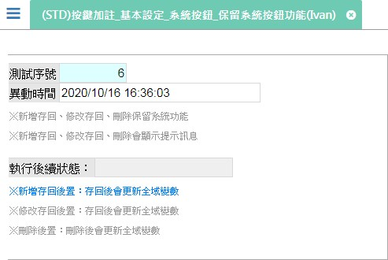

[←back list](FX999500001767.md) | [Version History](#change-record)

# (STD)按鍵加註_基本設定_系統按鈕_保留系統按鈕功能(Ivan)

## 操作步驟
* ### 測試案例：保留系統按鈕功能=Y、使用系統提示訊息盒=Y
	* 執行功.新增，再執行功.新增存回(會有確認是否存回的訊息)，存回後會回到瀏覽模式並移至最後一筆資料，請確認異動時間是否正確
	* 執行功.修改，再執行功.修改存回(會有確認是否存回的訊息)，存回後會回到瀏覽模式，請確認異動時間是否正確
	* 執行功.刪除(會有確認是否刪除的訊息)，執行成功會顯示上一筆資料
    
* ### 測試案例：新增存回-延續執行 (匯入程式會判斷當內鍵類型=3.交易元時，內鍵執行時機為1.同時，其餘皆給2.延續)
	* 執行功.新增，再執行功.新增存回，資料存回後會再執行全域變數更新(更新為"新增存回後* 續執行完成")，可在元件.執行後續狀態 檢視全域變數的值
    
* ### 測試案例：修改存回-延續執行 (匯入程式會判斷當內鍵類型=3.交易元時，內鍵執行時機為1.同時，其餘皆給2.延續)
	* 執行功.修改，再執行功.修改存回，資料存回後會再執行全域變數更新(更新為"修改存回後* 續執行完成")，可在元件.執行後續狀態 檢視全域變數的值
   
* ### 測試案例：刪除-延續執行 (匯入程式會判斷當內鍵類型=3.交易元時，內鍵執行時機為1.同時，其餘皆給2.延續)	
	* 執行功.刪除，資料刪除後會再執行全域變數更新(更新為"刪除後續執行完成")，可在元件.執行後續狀態 檢視全域變數的值

## 
案例異動說明

|異動版本|異動日期|異動人員|修正內容|
|--------|-------|-------|-------|

[↑ Back to Top](#head)