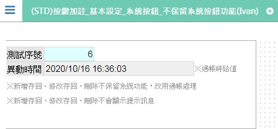

[←back list](FX999500001767.md) | [Version History](#change-record)

# (STD)按鍵加註_基本設定_系統按鈕_不保留系統按鈕功能(Ivan)

## 操作步驟
* ### 測試案例：保留系統按鈕功能=N、使用系統提示訊息盒=N	
	* 執行功.新增，再執行功.新增存回(不會有確認是否存回的訊息)，此時是透過資料交易新增資料，執行成功會回到瀏覽模式並移至最後一筆資料，請確認異動時間是否有更新(異動時間為過帳給值)

	* 新增資料後，執行功.修改，再執行功.修改存回(不會有確認是否存回的訊息)，此時是透過資料交易修改資料，執行成功會回到瀏覽模式，請確認異動時間是否有更新(異動時間為過帳給值)

	* 執行功.刪除(不會有確認是否刪除的訊息)，此時是透過資料交易刪除資料，執行成功會顯示上一筆資料

## 
案例異動說明

|異動版本|異動日期|異動人員|修正內容|
|--------|-------|-------|-------|

[↑ Back to Top](#head)