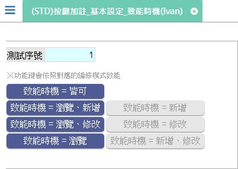

[←back list](FX999500001767.md) | [Version History](#change-record)

# (STD)按鍵加註_基本設定_致能時機(Ivan)

## 操作步驟
* 新增表頭資料後存回	
	
* ### 測試案例：新增=Y & 修改=Y & 瀏覽=Y	
	* 功.致能時機 = 皆可：新增狀態、修改狀態、瀏覽狀態 時致能

* ### 測試案例：新增=Y & 修改=N & 瀏覽=Y	
	* 功.致能時機 = 瀏覽、新增：新增狀態、瀏覽狀態 時致能，修改狀態 時除能

* ### 測試案例：新增=Y & 修改=N & 瀏覽=N	
	* 功.致能時機 = 新增：新增狀態 時致能，修改狀態、瀏覽狀態 時除能

* ### 測試案例：新增=N & 修改=Y & 瀏覽=Y	
	* 功.致能時機 = 瀏覽、修改：修改狀態、瀏覽狀態 時致能，新增狀態 時除能

* ### 測試案例：新增=N & 修改=Y & 瀏覽=N	
	* 功.致能時機 = 修改：修改狀態 時致能，新增狀態、瀏覽狀態 時除能

* ### 測試案例：新增=N & 修改=N & 瀏覽=Y	
	* 功.致能時機 = 瀏覽：瀏覽狀態 時致能，新增狀態、修改狀態 時除能

* ### 測試案例：新增=Y & 修改=Y & 瀏覽=N	
	* 功.致能時機 = 新增、修改：新增狀態、修改狀態 時致能，瀏覽狀態 時除能

## 
案例異動說明

|異動版本|異動日期|異動人員|修正內容|
|--------|-------|-------|-------|

[↑ Back to Top](#head)