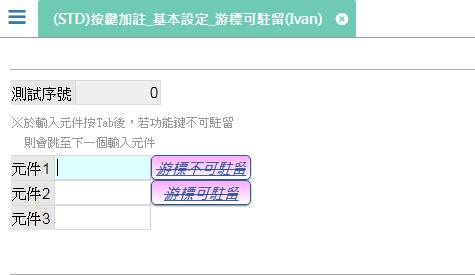

[←back list](FX999500001767.md) | [Version History](#change-record)

# (STD)按鍵加註_基本設定_游標可駐留(Ivan)

## 操作步驟
* 新增表頭資料後存回	
	
* ### 測試案例：新增=Y & 修改=Y & 瀏覽=Y	
	* 功.致能時機 = 皆可：新增狀態、修改狀態、瀏覽狀態 時致能

## 操作步驟		
* 進入新增	
		
* ### 測試案例：游標可駐留=N	
	* 駐留元件.元件1，因為功.游標不可駐留 的游標可駐留為N，所以按Tab鍵會直接駐留到元件.元件2
		
* ### 測試案例：游標可駐留=Y	
	* 駐留元件.元件2，按Tab鍵會駐留到功.游標可駐留，再按一次Tab才會駐留到元件.元件3。功能鍵駐留樣式如右圖所示

## 
案例異動說明

|異動版本|異動日期|異動人員|修正內容|
|--------|-------|-------|-------|

[↑ Back to Top](#head)