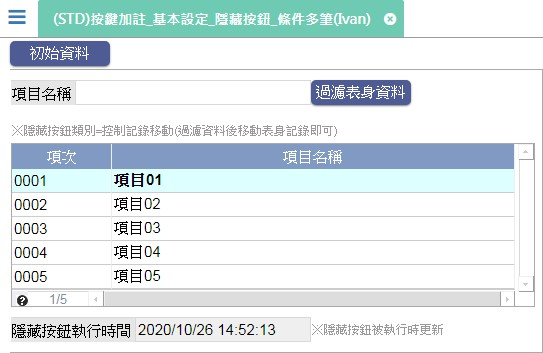

[←back list](FX999500001767.md) | [Version History](#change-record)

# (STD)按鍵加註_基本設定_隱藏按鈕_條件多筆(Ivan)

## 操作步驟
* 執行功.初始資料 後再執行功.過濾表身資料

* ### 測試案例：隱藏按鈕類別=控制記錄移動(條件多筆)
	* 表身資料移動時會呼叫隱藏按鈕.控制記錄移動，該功能鍵會執行全域變數更新(更新為執行時的系統日期時間)，可在元件.隱藏按鈕執行時間 檢視全域變數的值

## 
案例異動說明

|異動版本|異動日期|異動人員|修正內容|
|--------|-------|-------|-------|

[↑ Back to Top](#head)