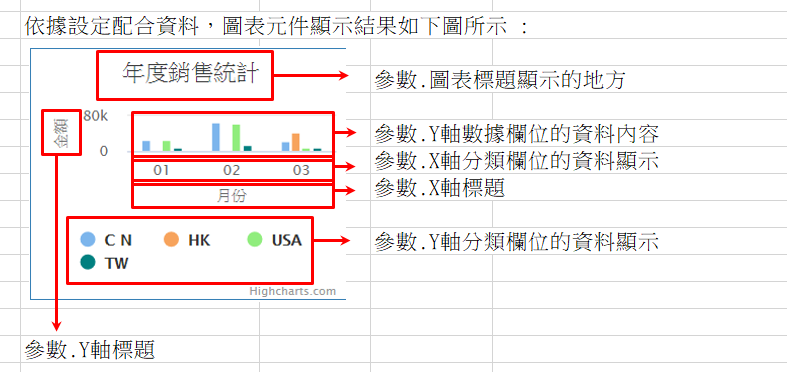
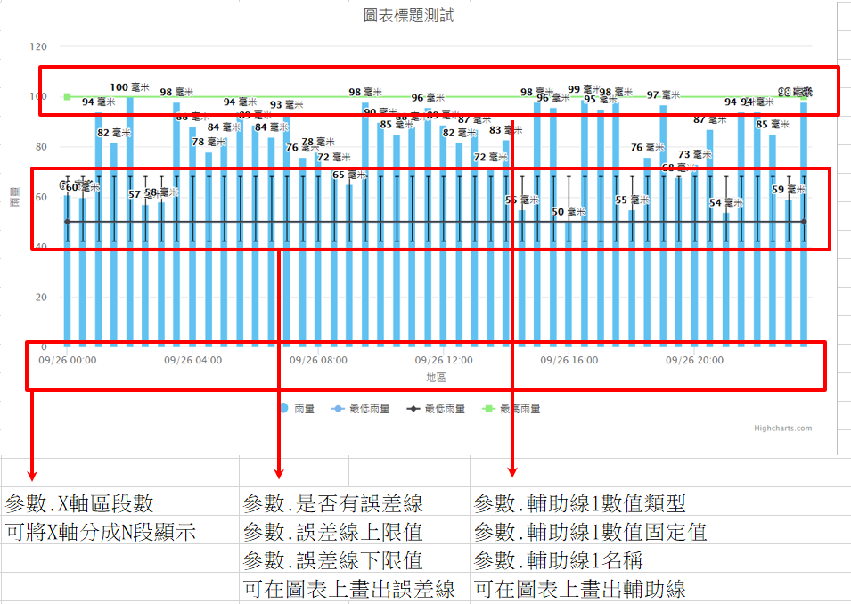

### 
長條圖 <path>(物件類別\圖表\圖表類型)

| 參數名稱        | 可空白	  	  | 來源型態	   | 參數說明	    |
|:------------- |:------------- |:------------- |:------------- |
| 圖表標題	| V	| 多語詞庫	| 顯示圖表的標題| 
| X軸標題	| 	| 多語詞庫	| X軸顯示標題| 
| Y軸標題	| 	| 多語詞庫	| Y軸顯示標題| 
| 來源邏輯表格	| 	| 檢視表	| 顯示圖表的資料來源| 
| 來源過濾運算式	| V| 	條件式	| 顯示圖表的資料來源過濾式| 
| X軸分類欄位	| 	| 查表欄位	| 圖表X軸分群用的欄位名稱| 
| Y軸分類欄位	| V	| 查表欄位	| 圖表Y軸分群用的欄位名稱，<ps>當參數.X軸區段數有值，本參數無效</ps>| 
| Y軸數據欄位	| 	| 查表欄位	| 圖表Y軸的資料欄位| 
| Y軸數據計算方式	| 	| 選項	| 1.Max : 顯示Y軸數據欄位的最大值 2.Min : 顯示Y軸數據欄位的最小值 3.Sum : 顯示Y軸數據欄位的總和 4.Avg : 顯示Y軸數據欄位的平均值 5.Count : 顯示Y軸數據欄位的數量| 
| 顯示資料時的單位	| V	| 多語詞庫	| 顯示在數據資料後的單位名稱| 
| 是否在線圖上顯示資料值	| 	| 選項	| TRUE / FALSE| 
| 排序方式	| V	| 選項	| 1.升冪/2.降冪  | 未設定時為升冪| 
| X軸區段數 	| V	| 固定值	| 表示X軸要依據資料最大最小值當作區間切成幾等份| 
| X軸模板	| V	| 選項	| 當X軸區段數有設定時，X軸資料顯示模板，<ps>當參數.X軸區段數有值時，本參數必須有值</ps>。 1.原值 2.整數 3.小數兩位 4.年 5.月 6.日 7.年/月 8.年/月/日 9.月/日 10.月/日 時:分 11.時:分| 
| 輔助線1數值類型	| V	| 選項	| 1.固定值 / 2.資料來源最小值 / 3.資料來源最大值 / 4.資料來源平均值| 
| 輔助線1數值固定值	| V	| 固定值	| 輔助線的數值，<ps>當參數.輔助線1數值類型為1.固定值，本參數必須有值</ps>| 
| 輔助線1名稱	| V	| 多語詞庫	| 輔助線的名稱| 
| 輔助線2數值類型	| V	| 選項	| 1.固定值 / 2.資料來源最小值 / 3.資料來源最大值 / 4.資料來源平均值| 
| 輔助線2數值固定值	| V	| 固定值	| 輔助線的數值，<ps>當參數.輔助線2數值類型為1.固定值，本參數必須有值</ps>| 
| 輔助線2名稱	| V	| 多語詞庫	| 輔助線的名稱| 
| 輔助線3數值類型	| V	| 選項	| 1.固定值 / 2.資料來源最小值 / 3.資料來源最大值 / 4.資料來源平均值| 
| 輔助線3數值固定值	| V	| 固定值	| 輔助線的數值，<ps>當參數.輔助線3數值類型為1.固定值，本參數必須有值</ps>| 
| 輔助線3名稱	| V	| 多語詞庫	| 輔助線的名稱| 
| 是否有誤差線 	| V	| 選項	 | 1.有 / 0.沒有| 
| 誤差上限值欄位	| V	| 查表欄位	| 紀錄誤差上限值的欄位名稱，<ps>當參數.是否有誤差線為1.有，本參數必須有值</ps>| 
| 誤差下限值欄位	| V	| 查表欄位	| 紀錄誤差下限值的欄位名稱，<ps>當參數.是否有誤差線為1.有，本參數必須有值</ps>| 
| X軸分群排序欄位	| V	| 查表欄位	| 當有指定時依照此欄位進行X軸分群結果的排序| 
| Y欄分類排序方式	| V	| 選項	| 1.升冪 / 2.降冪| 
| 標題替換字1	| V	| 運算式	| 替換圖表標題裡%P1的值| 
| 標題替換字2	| V	| 運算式	| 替換圖表標題裡%P2的值| 

* 範例說明1 : 長條圖依照XY軸分群顯示

    長條圖設定

    | 參數名稱	| 來源型態	| 來源內容| 
    |:------------- |:------------- |:------------- |
    | 圖表標題	| 多語詞庫	| 年度銷售統計| 
    | X軸標題	| 多語詞庫	| 月份| 
    | Y軸標題	| 多語詞庫	| 金額| 
    | 來源邏輯表格	| 檢視表	| 圖表元件_表格| 
    | X軸分類欄位	| 查表欄位	| 月份| 
    | Y軸分類欄位	| 查表欄位	| 地區| 
    | Y軸數據欄位	| 查表欄位	| 金額| 
    | Y軸數據計算方式	| 選項	| Avg| 
    | 是否在線圖上顯示資料值	| 選項	| FALSE| 
    | 排序方式	| 選項	| 升冪| 

    檢視表.圖表元件_表格

    | 地區	| 月份	| 金額
    |:------------- |:------------- |:------------- |
    | CN	| 01	| 2244| 
    | CN	| 02	| 101031| 
    | CN	| 03	| 2099| 
    | HK	| 03	| 5654| 
    | USA	| 01	| 2153| 
    | USA	| 02	| 9766| 
    | USA	| 03	| 456| 
    | TW	| 01	| 550| 
    | TW	| 02	| 690| 
    | TW	| 03	| 321| 

    依據設定配合資料，圖表元件顯示結果如下圖所示

    

* 範例說明2 : 長條圖依照時間區間顯示資料 + 輔助線 + 誤差線

    長條圖設定

    | 參數名稱	| 來源型態	| 來源內容| 
    |:------------- |:------------- |:------------- |
    | 圖表標題	| 多語詞庫	| %P1標題%P2| 
    | X軸標題	| 多語詞庫	| 地區| 
    | Y軸標題	| 多語詞庫	| 雨量| 
    | 來源邏輯表格	| 檢視表	| 元件加註_嵌入物件_長條圖_等份圖(Rita)| 
    | 來源過濾運算式	| 條件式	| 來源.地區 = 元件.地區| 
    | X軸分類欄位	| 查表欄位	| 建立時間| 
    | Y軸數據欄位	| 查表欄位	| 雨量| 
    | Y軸數據計算方式	| 選項	| Avg| 
    | 顯示資料時的單位	| 多語詞庫	| 毫米| 
    | 是否在線圖上顯示資料值	| 選項	| TRUE| 
    | 排序方式	| 選項	| 升冪| 
    | X軸區段數 	| 固定值	| 5| 
    | X軸模板	| 選項	| 10.月/日 時:分| 
    | 輔助線1數值類型	| 選項	| 1.固定值| 
    | 輔助線1數值固定值	| 固定值	| 70| 
    | 輔助線1名稱	| 多語詞庫	| 大雨預報| 
    | 輔助線2數值類型	| 選項	| 2.資料來源最小值| 
    | 輔助線2名稱	| 多語詞庫	| 最低雨量| 
    | 輔助線3數值類型	| 選項	| 3.資料來源最大值| 
    | 輔助線3名稱	| 多語詞庫	| 最高雨量| 
    | 是否有誤差線 	| 選項	 | 1.有| 
    | 誤差上限值欄位	| 查表欄位	| 誤差上限| 
    | 誤差下限值欄位	| 查表欄位	| 誤差下限| 
    | 標題替換字1	| 運算式	| 圖表| 
    | 標題替換字2	| 運算式	| 測試| 

    檢視表.元件加註_嵌入物件_長條圖_等份圖(Rita)

    | 地區	| 雨量	| 誤差上限	| 誤差下限  | 建立時間 |
    |:------------- |:------------- |:------------- |:------------- |:------------- |
    | 北部  | 61	| 68	| 42	| 2020/9/26 00 : 00 : 00 | 
    | 北部  | 60	| 68	| 42	| 2020/9/26 00 : 30 : 00 | 
    | 北部  | 94	| 68	| 42	| 2020/9/26 01 : 00 : 00 | 
    | 北部  | 82	| 68	| 42	| 2020/9/26 01 : 30 : 00| 
    | 北部  | 100	| 68	| 42	| 2020/9/26 02 : 00 : 00| 
    | 北部  | 57	| 68	| 42	| 2020/9/26 02 : 30 : 00| 
    | 北部  | 58	| 68	| 42	| 2020/9/26 03 : 00 : 00| 
    | 北部  | 98	| 68	| 42	| 2020/9/26 03 : 30 : 00| 
    | 北部  | 88	| 68	| 42	| 2020/9/26 04 : 00 : 00| 
    | 北部  | 78	| 68	| 42	| 2020/9/26 04 : 30 : 00| 
    | 北部  | 84	| 68	| 42	| 2020/9/26 05 : 00 : 00| 
    | 北部  | 94	| 68	| 42	| 2020/9/26 05 : 30 : 00| 
    | 北部  | 89	| 68	| 42	| 2020/9/26 06 : 00 : 00| 
    | 北部  | 84	| 68	| 42	| 2020/9/26 06 : 30 : 00| 
    | 北部  | 93	| 68	| 42	| 2020/9/26 07 : 00 : 00| 
    | 北部  | 76	| 68	| 42	| 2020/9/26 07 : 30 : 00| 
    | 北部  | 78	| 68	| 42	| 2020/9/26 08 : 00 : 00| 
    | 北部  | 72	| 68	| 42	| 2020/9/26 08 : 30 : 00| 
    | 北部  | 65	| 68	| 42	| 2020/9/26 09 : 00 : 00| 
    | 北部  | 98	| 68	| 42	| 2020/9/26 09 : 30 : 00| 
    | 北部  | 90	| 68	| 42	| 2020/9/26 10 : 00 : 00| 
    | 北部  | 85	| 68	| 42	| 2020/9/26 10 : 30 : 00| 
    | 北部  | 88	| 68	| 42	| 2020/9/26 11 : 00 : 00| 
    | 北部  | 96	| 68	| 42	| 2020/9/26 11 : 30 : 00| 
    | 北部  | 89	| 68	| 42	| 2020/9/26 12 : 00 : 00| 
    | 北部  | 82	| 68	| 42	| 2020/9/26 12 : 30 : 00| 
    | 北部  | 87	| 68	| 42	| 2020/9/26 13 : 00 : 00| 
    | 北部  | 72	| 68	| 42	| 2020/9/26 13 : 30 : 00| 
    | 北部  | 83	| 68	| 42	| 2020/9/26 14 : 00 : 00| 
    | 北部  | 55	| 68	| 42	| 2020/9/26 14 : 30 : 00| 
    | 北部  | 98	| 68	| 42	| 2020/9/26 15 : 00 : 00| 
    | 北部  | 96	| 68	| 42	| 2020/9/26 15 : 30 : 00| 
    | 北部  | 50	| 68	| 42	| 2020/9/26 16 : 00 : 00| 
    | 北部  | 99	| 68	| 42	| 2020/9/26 16 : 30 : 00| 
    | 北部  | 95	| 68	| 42	| 2020/9/26 17 : 00 : 00| 
    | 北部  | 98	| 68	| 42	| 2020/9/26 17 : 30 : 00| 
    | 北部  | 55	| 68	| 42	| 2020/9/26 18 : 00 : 00| 
    | 北部  | 76	| 68	| 42	| 2020/9/26 18 : 30 : 00| 
    | 北部  | 97	| 68	| 42	| 2020/9/26 19 : 00 : 00| 
    | 北部  | 68	| 68	| 42	| 2020/9/26 19 : 30 : 00| 
    | 北部  | 73	| 68	| 42	| 2020/9/26 20 : 00 : 00| 
    | 北部  | 87	| 68	| 42	| 2020/9/26 20 : 30 : 00| 
    | 北部  | 54	| 68	| 42	| 2020/9/26 21 : 00 : 00| 
    | 北部  | 94	| 68	| 42	| 2020/9/26 21 : 30 : 00| 
    | 北部  | 94	| 68	| 42	| 2020/9/26 22 : 00 : 00| 
    | 北部  | 85	| 68	| 42	| 2020/9/26 22 : 30 : 00| 
    | 北部  | 59	| 68	| 42	| 2020/9/26 23 : 00 : 00| 
    | 北部  | 98	| 68	| 42	| 2020/9/26 23 : 30 : 00| 

    依據設定配合資料，圖表元件顯示結果如下圖所示

    
