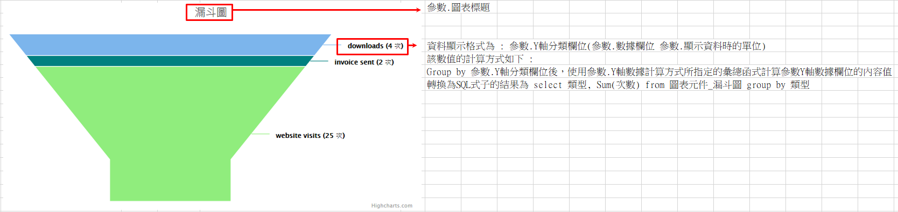

### 
漏斗圖 <path>(物件類別\圖表\圖表類型)

| 參數名稱        | 可空白	  	  | 來源型態	   | 參數說明	    |
|:------------- |:------------- |:------------- |:------------- |
| 圖表標題	| V	| 多語詞庫	| 顯示圖表的標題| 
| Y軸標題	| 	| 多語詞庫	| Y軸顯示標題| 
| 來源邏輯表格	| 	| 檢視表	| 顯示圖表的資料來源| 
| 來源過濾運算式	| V	| 條件式	| 顯示圖表的資料來源過濾式| 
| Y軸分類欄位		| | 查表欄位	| 分群用欄位| 
| Y軸數據欄位		| | 查表欄位	| Y軸數據欄位| 
| Y軸數據計算方式	| 	| 選項	| 1.Max : 顯示Y軸數據欄位的最大值 2.Min : 顯示Y軸數據欄位的最小值 3.Sum : 顯示Y軸數據欄位的總和 4.Avg : 顯示Y軸數據欄位的平均值 5.Count : 顯示Y軸數據欄位的數量| 
| 顯示資料時的單位	| 	| 多語詞庫	| 表示目前的顯示資料單位| 
| 標題替換字1	| V	| 運算式	| 替換圖表標題裡%P1的值| 
| 標題替換字2	| V	| 運算式	| 替換圖表標題裡%P2的值| 

* 範例說明

    漏斗圖設定

    | 參數名稱	| 來源型態	| 來源內容| 
    |:------------- |:------------- |:------------- |
    | 圖表標題	| 多語詞庫	| 漏斗圖| 
    | Y軸標題		| 多語詞庫	| Unique users| 
    | 來源邏輯表格	| 檢視表	| 元件加註-嵌入物件_漏斗圖| 
    | Y軸分類欄位		| 查表欄位	| 類型| 
    | Y軸數據欄位		| 查表欄位	| 次數| 
    | Y軸數據計算方式		| 選項	| Sum| 
    | 顯示資料時的單位	| 多語詞庫	| 次| 

    檢視表.元件加註-嵌入物件_漏斗圖

    | 類型	| 次數	| 日期
    |:------------- |:------------- |:------------- |
    | downloads	| 1	| 2020/10/10 |
    | downloads	| 3	| 2020/10/11 |
    | invoice sent	| 2	| 2020/10/10 |
    | website visits| 25	| 2020/10/10 |

    依據設定配合資料，圖表元件顯示結果如下圖所示

    