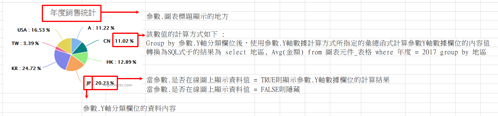

### 
圓餅圖 <path>(物件類別\圖表\圖表類型)</path>

| 參數名稱        | 可空白	  	  | 來源型態	   | 參數說明	    |
|:------------- |:------------- |:------------- |:------------- |
| 圖表標題	| V	| 多語詞庫	| 顯示圖表的標題|
| 來源邏輯表格	| 	| 檢視表| 	顯示圖表的資料來源| 
| 來源過濾運算式| 	V	| 條件式	| 顯示圖表的資料來源過濾式| 
| Y軸分類欄位	| 	| 查表欄位	| 圖表Y軸分群用的欄位名稱| 
| Y軸數據欄位	| 	| 查表欄位	| 圖表Y軸的資料欄位| 
| Y軸數據計算方式| 	| 	選項	| 1.Max : 顯示Y軸數據欄位的最大值 2.Min : 顯示Y軸數據欄位的最小值 3.Sum : 顯示Y軸數據欄位的總和 4.Avg : 顯示Y軸數據欄位的平均值 5.Count : 顯示Y軸數據欄位的數量 | 
| 是否在線圖上顯示資料值| 		| 選項	| TRUE / FALSE| 
| 標題替換字1	| V	| 運算式	| 替換圖表標題裡%P1的值| 
| 標題替換字2	| V	| 運算式	| 替換圖表標題裡%P2的值| 

* 範例說明

    圓餅圖設定

    | 參數名稱	| 來源型態	| 來源內容| 
    |:------------- |:------------- |:------------- |
    | 圖表標題	| 多語詞庫	| 年度銷售統計| 
    | 來源邏輯表格| 檢視表	| 圖表元件_表格| 
    | 來源過濾運算式	| 條件式	| 欄位.年度=2017| 
    | Y軸分類欄位		| 查表欄位	| 地區| 
    | Y軸數據欄位		| 查表欄位	| 金額| 
    | Y軸數據計算方式	| 選項	| Avg| 
    | 是否在線圖上顯示資料值	| 選項	| TRUE| 

    檢視表.圖表元件_表格

    | 地區	| 年度	| 金額	| 過濾條件成立| 
    |:------------- |:------------- |:------------- |:------------- |
    | A	| 2017	| 78540	| V| 
    | B	| 2016	| 202013| | 	
    | C	| 2019	| 192530| | 	
    | CN	| 2017	| 100000	|V | 
    | CN	| 2017	| 54280	| V| 
    | HK	| 2017	| 90230	| V| 
    | JP	| 2017	| 141610	| V| 
    | KR	| 2017	| 173040	| V| 
    | TW	| 2017	| 23730	| V| 
    | USA	| 2017	| 115710	| V| 

    依據設定配合資料，圖表元件顯示結果如下圖所示

    