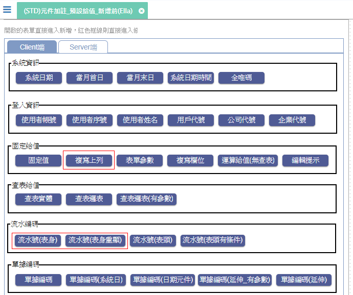

# (STD)元件加註_預設給值_新增前(Ella)

* Client端
    * 系統日期 [(STD)元件加註_預設給值_系統日期_Client端(Ella)]
    * 當月首日 [(STD)元件加註_預設給值_當月首日_Client端(Ella)]
    * 當月末日 [(STD)元件加註_預設給值_當月末日_Client端(Ella)]
    * 系統日期時間 [(STD)元件加註_預設給值_系統日期時間_Client端(Ella)]
    * 全唯碼 [(STD)元件加註_預設給值_全唯碼_Client端(Ella)]
    * 使用者帳號 [(STD)元件加註_預設給值_使用者帳號_Client端(Ella)]
    * 使用者序號 [(STD)元件加註_預設給值_使用者序號_Client端(Ella)]
    * 使用者姓名 [(STD)元件加註_預設給值_使用者姓名_Client端(Ella)]
    * 用戶代號 [(STD)元件加註_預設給值_用戶代號_Client端(Ella)]
    * 公司代號 [(STD)元件加註_預設給值_公司代號_Client端(Ella)]
    * 企業代號 [(STD)元件加註_預設給值_企業代號_Client端(Ella)]
    * 固定值 [(STD)元件加註_預設給值_固定值_Client端(Ella)]
    * 複製上列 [(STD)元件加註_預設給值_複寫上列_Client端(Ella)]
    * 表單參數 [(STD)元件加註_預設給值_參數_Client端(Ella)]
    * 複製欄位 [(STD)元件加註_預設給值_複寫欄位_Client端(Ella)]
    * 運算給值(無查表) [(STD)元件加註_預設給值_運算給值(無查表)_Client端(Ella)]
    * 編輯提示 [(STD)元件加註_預設給值_編輯提示_Client端(Ella)]
    * 查詢實體 [(STD)元件加註_預設給值_查表給值(實體)_Client端(Ella)]
    * 查詢邏表 [(STD)元件加註_預設給值_查表給值(邏表)_Client端(Ella)]
    * 查詢邏表(有參數) [(STD)元件加註_預設給值_查表給值(邏表_有參數)_Client端(Ella)]
    * 流水號(表身) [(STD)元件加註_預設給值_流水編碼(表身)_Client端(Ella)]
    * 流水號(表身重顯) [(STD)元件加註_預設給值_流水編碼(表身重顯)_Client端(Ella)]
    * 流水號(表頭) [(STD)元件加註_預設給值_流水編碼(表頭)_Client端(Ella)]
    * 流水號(表頭有條件) [(STD)元件加註_預設給值_流水編碼(表頭_有條件)_Client端(Ella)]
    * 單據編碼 [(STD)元件加註_預設給值_單據編碼_Client端(Ella)]
    * 單據編碼(系統日) [(STD)元件加註_預設給值_單據編碼(系統日)_Client端(Ella)]
    * 單據編碼(日期元件) [(STD)元件加註_預設給值_單據編碼(日期元件)_Client端(Ella)]
    * 單據編碼(延伸_有參數) [(STD)元件加註_預設給值_單據編碼(延伸)_Client端(Ella)] 有設定傳遞參數
    * 單據編碼(延伸) [(STD)元件加註_預設給值_單據編碼(延伸)_Client端(Ella)] 無設定傳遞參數
    

* Server端
    * Server端 [(STD)元件加註_預設給值_新增前_Server端(Ella)]

[(STD)元件加註_預設給值_系統日期_Client端(Ella)]:FX999500001845.md ""
[(STD)元件加註_預設給值_當月首日_Client端(Ella)]:FX999500001846.md ""
[(STD)元件加註_預設給值_當月末日_Client端(Ella)]:FX999500001847.md ""
[(STD)元件加註_預設給值_系統日期時間_Client端(Ella)]:FX999500001848.md ""
[(STD)元件加註_預設給值_全唯碼_Client端(Ella)]:FX999500001849.md ""
[(STD)元件加註_預設給值_使用者帳號_Client端(Ella)]:FX999500001850.md ""
[(STD)元件加註_預設給值_使用者序號_Client端(Ella)]:FX999500001851.md ""
[(STD)元件加註_預設給值_使用者姓名_Client端(Ella)]:FX999500001852.md ""
[(STD)元件加註_預設給值_用戶代號_Client端(Ella)]:FX999500001853.md ""
[(STD)元件加註_預設給值_公司代號_Client端(Ella)]:FX999500001854.md ""
[(STD)元件加註_預設給值_企業代號_Client端(Ella)]:FX999500001855.md ""
[(STD)元件加註_預設給值_固定值_Client端(Ella)]:FX999500001857.md ""
[(STD)元件加註_預設給值_複寫上列_Client端(Ella)]:FX999500001858.md ""
[(STD)元件加註_預設給值_參數_Client端(Ella)]:FX999500001859.md ""
[(STD)元件加註_預設給值_複寫欄位_Client端(Ella)]:FX999500001860.md ""
[(STD)元件加註_預設給值_運算給值(無查表)_Client端(Ella)]:FX999500001861.md ""
[(STD)元件加註_預設給值_編輯提示_Client端(Ella)]:FX999500001862.md ""
[(STD)元件加註_預設給值_查表給值(實體)_Client端(Ella)]:FX999500001863.md ""
[(STD)元件加註_預設給值_查表給值(邏表)_Client端(Ella)]:FX999500001864.md ""
[(STD)元件加註_預設給值_查表給值(邏表_有參數)_Client端(Ella)]:FX999500001865.md ""
[(STD)元件加註_預設給值_流水編碼(表身)_Client端(Ella)]:FX999500001866.md ""
[(STD)元件加註_預設給值_流水編碼(表身重顯)_Client端(Ella)]:FX999500001869.md ""
[(STD)元件加註_預設給值_流水編碼(表頭)_Client端(Ella)]:FX999500001870.md ""
[(STD)元件加註_預設給值_流水編碼(表頭_有條件)_Client端(Ella)]:FX999500001872.md ""
[(STD)元件加註_預設給值_新增前_Server端(Ella)]:FX999500001883.md ""
[(STD)元件加註_預設給值_單據編碼_Client端(Ella)]:FX999500001874.md ""
[(STD)元件加註_預設給值_單據編碼(系統日)_Client端(Ella)]:FX999500001875.md ""
[(STD)元件加註_預設給值_單據編碼(日期元件)_Client端(Ella)]:FX999500001879.md ""
[(STD)元件加註_預設給值_單據編碼(延伸)_Client端(Ella)]:FX999500001880.md