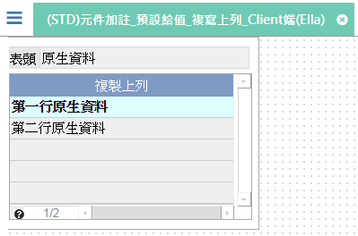
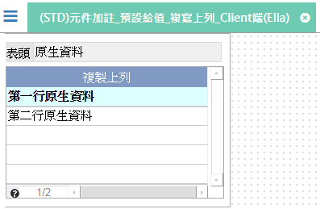
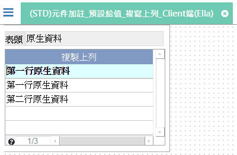

[上一頁]({back})
# (STD)元件加註_預設給值_複寫上列_Client端(Ella)

## 元件說明
* 表頭：實體原生資料產生"原生資料"
* 複製上列：
    1. 實體原生資料產生兩筆"第一行原生資料"、"第二行原生資料"
    2. 新增一筆資料時自動產生剛剛駐留的那一筆資料內容
## 操作步驟
1. 駐留第一筆資料

2. 新增一筆資料(自動產生剛剛駐留的那一筆資料內容)

