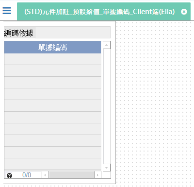

[上一頁]({back})
# (STD)元件加註_預設給值_單據編碼_Client端(Ella)

## 元件說明
* 編碼依據：固定產生"編碼依據來源值"。
* 單據編碼：依`照編碼格式`(KKK-DRE9999)產生編碼流水號。
    * KKK：表單欄位.編碼依據(取三碼)。
    * -：固定內容。
    * DRE：固定內容。
    * 9：A ~ Z。
    * 9：0 ~ 9 + A ~ Z (不含 I、O、Z)。
    * 9：0 ~ 9 + A ~ Z。
    * 9：0 ~ 9。