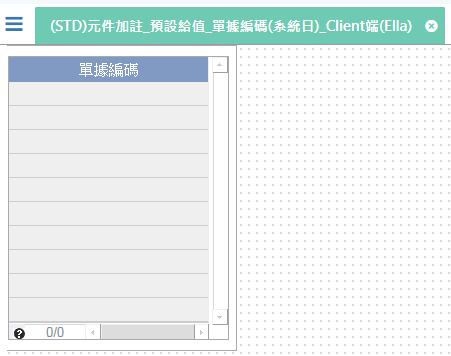

[上一頁]({back})
# (STD)元件加註_預設給值_單據編碼(系統日)_Client端(Ella)

## 元件說明
* 單據編碼：依`照編碼格式`(YYYY-MM-DD(WW)-9)產生編碼流水號。
    * YYYY：`日期基礎`=`系統日期`，產生系統日期的年度4碼。
    * -：固定內容。
    * MM：`日期基礎`=`系統日期`，產生系統日期的月份2碼。
    * DD：`日期基礎`=`系統日期`，產生系統日期的日期2碼。
    * (：
    * WW：`日期基礎`=`系統日期`，產生系統日期的週次2碼。
    * )：固定內容。
    * -：固定內容。
    * 9：0 ~ 9。