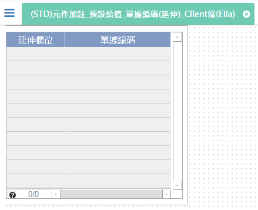

[上一頁]({back})
# (STD)元件加註_預設給值_單據編碼(延伸)_Client端(Ella)

## 元件說明
* 延伸欄位：取得前單傳入的參數內容值(內容值：前單傳的)
* 單據編碼：不同的元件.延伸欄位，依照`編碼格式`(PNE999)產生編碼流水號。
    * PNE：固定內容。
    * 999：0 ~ 9。

* 案例
    |延伸欄位|單據編碼|
    |-------|--------|
    |前單傳的|PNE001|
    |前單傳的|PNE002|
    ||PNE001|
    ||PNE002|