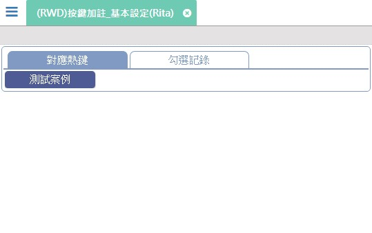
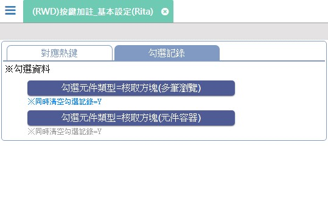

[←back list](..\rte_ButtonAnnotation.md) | [Version History](#change-record)

# (RWD)按鍵加註_基本設定(Rita)

## 依測試項目駐留不同頁籤，並執行功能鍵開啟相關案例表單

* [對應熱鍵](#hotkey)
* [勾選記錄](#chkrecord)

### 
對應熱鍵

* 功.測試案例 [(RWD)表單元件_功能按鈕(Rita)]() **案例待補**

### 
勾選記錄

* 功.勾選元件類型=核取方塊(多筆瀏覽) [(RWD)表單元件_多筆瀏覽(Rita)]() **案例待補**

* 功.勾選元件類型=核取方塊(元件容器) [(RWD)表單元件_元件容器(Rita)]() **案例待補**

## 
案例異動說明

|異動版本|異動日期|異動人員|修正內容|
|--------|-------|-------|-------|
|8.9.2|2020/10/15|Ivan|增加頁籤.對應熱鍵，並在該頁籤內增加功.測試案例，開啟表單<(RWD)表單元件_功能按鈕(Rita)>|

[↑ Back to Top](#head)