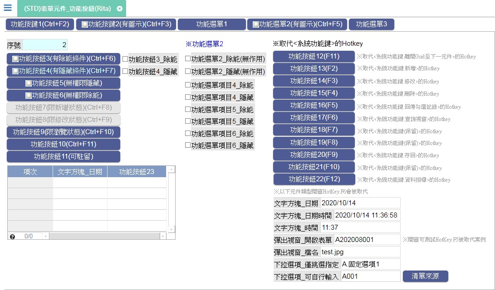

[←back list](FX999500001767.md) | [Version History](#change-record)

# (STD)表單元件_功能按鈕(Rita)

## 操作步驟
* 新增表頭、表身資料後存回										
											
* ### 測試案例：對應熱鍵(按鈕類型=工具列選單/工具列按鈕)
    * 執行CTRL + F2，會執行功能按鍵1，執行後顯示訊息"【功能按鈕1】執行完成。"
    * 執行CTRL + F3，會執行功能按鍵2，執行後顯示訊息"【功能按鈕2】執行完成。"
    * 執行CTRL + F5，會開啟功能選單.功能選單2(有圖示)(Ctrl+F5)
	* 執行CTRL + F6，會執行功能按鈕3，執行後顯示訊息"【功能按鈕3】執行完成。"
	* 執行CTRL + F7，會執行功能按鈕4，執行後顯示訊息"【功能按鈕4】執行完成。"
	* 進入新增後，執行CTRL + F8，會執行功能按鈕7，執行後顯示訊息"【功能按鈕7】執行完成。"
	* 進入修改後，執行CTRL + F9，會執行功能按鈕8，執行後顯示訊息"【功能按鈕8】執行完成。"
	* 執行CTRL + F10，會執行功能按鈕9，執行後顯示訊息"【功能按鈕9】執行完成。"
	* 執行CTRL + F11，會執行功能按鈕10，執行後顯示訊息"【功能按鈕10】執行完成。"
	* 執行CTRL + F12，會執行功能按鈕23，執行後顯示訊息"【功能按鈕23】執行完成。"
	* 執行F11，會執行功能按鈕12，執行後顯示訊息"【功能按鈕12】執行完成。"
		>`與系統功能鍵_編輯狀態下離開多筆表格跳至下一個元件衝突，僅執行自訂鍵，系統功能鍵不執行	`
		* 進入新增/修改後，駐留多筆內元件.文字方塊_日期，執行F11，會執行功能按鈕12，執行後顯示訊息"【功能按鈕12】執行完成。"，而不會跳離多筆表格
	* 執行F2，會執行功能按鈕13，執行後顯示訊息"【功能按鈕13】執行完成。"與系統功能鍵_新增衝突，僅執行自訂鍵，系統功能鍵不執行	
											
	* 執行F3，會執行功能按鈕14，執行後顯示訊息"【功能按鈕14】執行完成。"與系統功能鍵_修改衝突，僅執行自訂鍵，系統功能鍵不執行	
											
	* 執行F4，會執行功能按鈕15，執行後顯示訊息"【功能按鈕15】執行完成。"與系統功能鍵_刪除衝突，僅執行自訂鍵，系統功能鍵不執行	
	* 執行F5，會執行功能按鈕16，執行後顯示訊息"【功能按鈕16】執行完成。"
		>`與系統功能鍵_回傳勾選的記錄衝突，僅執行自訂鍵，系統功能鍵不執行`
		* 進入修改後，駐留元件.彈出視窗_開啟表單，執行功.查詢視窗 開啟表單<(STD)表單元件_彈出視窗_挑選清單(多筆表格)(Hotkey.F5被取代)(Rita)>
		* 開單後再執行F5，會執行功能按鈕1，執行後顯示訊息"【功能按鈕1】執行完成。"，而不會執行回傳勾選
	* 執行F6，會執行功能按鈕17，執行後顯示訊息"【功能按鈕17】執行完成。"
		>`與系統功能鍵_查詢視窗衝突，僅執行自訂鍵，系統功能鍵不執行`

		* 進入修改後
            * 駐留元件.文字方塊_日期，執行F6，會執行功能按鈕17，而不會開啟行事曆
            * 駐留元件.文字方塊_日期時間，執行F6，會執行功能按鈕17，而不會開啟行事曆
            * 駐留元件.文字方塊_時間，執行F6，會執行功能按鈕17，而不會開啟時間設定
            * 駐留元件.彈出視窗_開啟表單，執行F6，會執行功能按鈕17，而不會開啟表單
            * 駐留元件.彈出視窗_檔名，執行F6，會執行功能按鈕17，而不會開啟檔案挑選
            * 駐留元件.下拉選項_僅挑選指定，執行F6，會執行功能按鈕17，而不會開啟下拉選項
            * 駐留元件.下拉選項_可自行輸入，執行F6，會執行功能按鈕17，而不會開啟Q下拉選項	
	* 執行F7，會執行功能按鈕18，執行後顯示訊息"【功能按鈕18】執行完成。"
	* 執行F8，會執行功能按鈕19，執行後顯示訊息"【功能按鈕19】執行完成。"
	* 執行F9，會執行功能按鈕20，執行後顯示訊息"【功能按鈕20】執行完成。"
		>`與系統功能鍵_存回衝突，僅執行自訂鍵，系統功能鍵不執行`
		* 進入新增/修改後，執行F9，會執行功能按鈕20，執行後顯示訊息"【功能按鈕20】執行完成。"，而不會執行系統存回
	* 執行F10，會執行功能按鈕21，執行後顯示訊息"【功能按鈕21】執行完成。"
	* 執行F12，會執行功能按鈕22，執行後顯示訊息"【功能按鈕22】執行完成。"
        >`與系統功能鍵_資料搜尋衝突，僅執行自訂鍵，系統功能鍵不執行`

* ### 測試案例：對應熱鍵(按鈕類型=選單內選項)
	* 執行SHIFT + A，會執行功能選單項目1，執行後顯示訊息"【功能選單項目1】執行完成。
		> `輸入法的操作與小選單_選項衝突，僅執行小選單_選項，輸入法操作不執行`
		* 進入修改後，駐留元件.彈出視窗_開啟表單，執行SHIFT + A，會執行功能選單項目1，而不會執行輸入法的大寫A

	* 執行SHIFT + B，會執行功能選單項目2，執行後顯示訊息"【功能選單項目2】執行完成。
	* 執行SHIFT + C，會執行功能選單項目3，執行後顯示訊息"【功能選單項目3】執行完成。
	* 執行SHIFT + D，會執行功能選單項目4，執行後顯示訊息"【功能選單項目4】執行完成。
	* 執行SHIFT + E，會執行功能選單項目5，執行後顯示訊息"【功能選單項目5】執行完成。
	* 執行SHIFT + F，會執行功能選單項目6，執行後顯示訊息"【功能選單項目6】執行完成。
	* 執行SHIFT + G，會執行功能選單項目7，執行後顯示訊息"【功能選單項目7】執行完成。
	* 執行SHIFT + H，會執行功能選單項目8，執行後顯示訊息"【功能選單項目8】執行完成。
	* 執行SHIFT + I，會執行功能選單項目9，執行後顯示訊息"【功能選單項目9】執行完成。
	* 執行SHIFT + J，會執行功能選單項目10，執行後顯示訊息"【功能選單項目10】執行完成。
	* 執行SHIFT + K，會執行功能選單項目11，執行後顯示訊息"【功能選單項目11】執行完成。
	* 執行SHIFT + L，會執行功能選單項目12，執行後顯示訊息"【功能選單項目12】執行完成。
	* 執行SHIFT + M，會執行功能選單項目13，執行後顯示訊息"【功能選單項目13】執行完成。
	* 執行SHIFT + N，會執行功能選單項目14，執行後顯示訊息"【功能選單項目14】執行完成。
	* 執行SHIFT + O，會執行功能選單項目15，執行後顯示訊息"【功能選單項目15】執行完成。
	* 執行SHIFT + P，會執行功能選單項目16，執行後顯示訊息"【功能選單項目16】執行完成。
	* 執行SHIFT + Q，會執行功能選單項目17，執行後顯示訊息"【功能選單項目17】執行完成。
	* 執行SHIFT + R，會執行功能選單項目18，執行後顯示訊息"【功能選單項目18】執行完成。
	* 執行SHIFT + S，會執行功能選單項目19，執行後顯示訊息"【功能選單項目19】執行完成。
	* 執行SHIFT + T，會執行功能選單項目20，執行後顯示訊息"【功能選單項目20】執行完成。
* ### 測試案例：除能條件
	* 進入新增後
        * 功.功能按鈕7 會變成致能狀態
		* 功.功能按鈕8 會變成除能狀態
		* 功.功能按鈕9 會變成除能狀態
											
	* 進入修改後
        * 功.功能按鈕8 會變成致能狀態
		* 功.功能按鈕7 會變成除能狀態
		* 功.功能按鈕9 會變成除能狀態
		* 將元件.功能按鈕3_除能 勾選，功.功能按鈕3 會變成除能狀態
		* 將元件.功能選單2_除能(無作用) 勾選，選單.功能選單2 還會是致能狀態，因選單的除能狀態必須是選單內所有功能鍵皆除能，選單才會除能
		* 將元件.功能選單項目4_除能 勾選，選單.功能選單2 內的功.功能選單項目4 會變成除能狀態	
		* 將元件.功能選單項目5_除能 勾選，選單.功能選單2 內的功.功能選單項目5 會變成除能狀態
		* 將元件.功能選單項目6_除能 勾選，選單.功能選單2 內的功.功能選單項目6 會變成除能狀態	
		* 將元件.功能選單項目4_除能、功能選單項目5_除能、功能選單項目6_除能 勾選，選單.功能選單2 會變成除能狀態
	* 瀏覽模式下
        * 功.功能按鈕9 會變成致能狀態
		* 功.功能按鈕7 會變成除能狀態
		* 功.功能按鈕8 會變成除能狀態
	* 使用帳號:guest01 密碼:abc123登入，功.功能按鈕6 會變成除能狀態
* ### 測試案例：隱藏條件
	* 進入修改後
        * 將元件.功能按鈕4_隱藏 勾選，功.功能按鈕4 會變成隱藏狀態
		* 將元件.功能選單2_隱藏(無作用) 勾選，選單.功能選單2 還會是顯示狀態，因選單的隱藏狀態必須是選單內所有功能鍵皆隱藏，選單才會隱藏
		* 將元件.功能選單項目4_隱藏 勾選，選單.功能選單2 內的功.功能選單項目4 會變成隱藏狀態
		* 將元件.功能選單項目5_隱藏 勾選，選單.功能選單2 內的功.功能選單項目5 會變成隱藏狀態
		* 將元件.功能選單項目6_隱藏 勾選，選單.功能選單2 內的功.功能選單項目6 會變成隱藏狀態	
		* 將元件.功能選單項目4_隱藏、功能選單項目5_隱藏、功能選單項目6_隱藏 勾選，選單.功能選單2 會變成隱藏狀態
		* 使用帳號:guest01 密碼:abc123登入，功.功能按鈕5 會變成隱藏狀態

* ### 測試案例：元件引用功能
	* 點擊標題.※功能選單2，選單.功能選單2 會展開

## 
案例異動說明

|異動版本|異動日期|異動人員|修正內容|
|--------|-------|-------|-------|

[↑ Back to Top](#head)