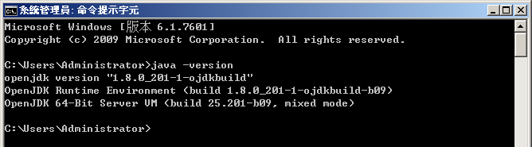
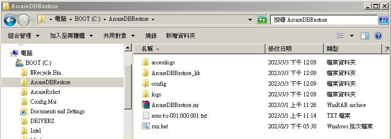
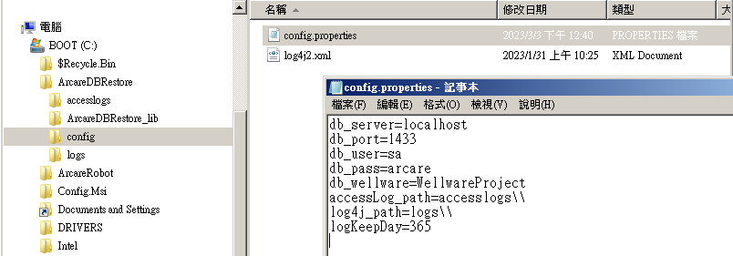

### 
使用前提

* 使用還原工具前（尤其是災後復原時），請務必滿足下列要求：
    1.	資料庫WellwareProject是存在的
    2.	要確認已取得由ArcareDBbackup所產出的備份檔(.bak&.trn)，並確實將其存放至原本備份檔案的原本位置上
    3.	確實已建立存放DB資料庫的對應目錄
    4.	機台確實已安裝過JAVA jre
        * 

### 
安裝步驟

* 作業目的：安裝資料庫還原工具
* 安裝檔案：asus-t-r-版本.zip
* 操作說明
    * 在目錄下(示範範例為C:\\)，直接解壓縮檔案【asus-t-r-版本.zip】可產生 ArcareDBRestore 資料夾
        * 
    * 請適當的編輯 config 資料夾下的檔案【config.properties】並儲存
        * 
        * 以下說明各參數用途及注意事項
            * db_server
                * 用途說明：資料庫位址，預設 localhost
            * db_port
                * 用途說明：資料庫連線port，預設 1433
            * db_user
                * 用途說明：資料庫連線帳號
            * db_pass
                * 用途說明：資料庫連線密碼(明碼)
            * db_._wellware
                * 用途說明：WellWareProject的資料庫名，預設 WellWareProject
            * accesslog_path
                * 用途說明：accesslog檔案路徑
                * 注意事項：資料夾路徑需存在於DB Server上，且資料夾分隔符號須注意逃脫字元，路徑格式範例: D:\\\logs 或 .\\\logs
            * log4j_path
                * 用途說明：restorelog檔案路徑
                * 注意事項：資料夾路徑需存在於DB Server上，且資料夾分隔符號須注意逃脫字元，路徑格式範例: D:\\\logs 或 .\\\logs
            * logKeepDay
                * 用途說明：log歷史記錄檔保留天數(單位=天)，當產生log歷史記錄檔時，即判斷log歷史記錄檔若超過保留天數則自動刪除，預設 365

### 
logs紀錄

* 還原工具有輸出兩個Log file，進行系統事件追蹤之用
    * 第一個是Accesslog，預設存放在”安裝目錄”下的子目錄accesslogs裡。
    * 第二個是Restorelog，預設存放在”安裝目錄”下的子目錄logs裡。
* logs檔案編碼為UTF-8
* logs欄位定義 : DateTime|LogKey|ID|API|ErrorCode|message|Client IP|ServerIP|ClientType|ClientVersion|X_Ver|SID|Manufacturer|ProductName|OS|SKUNumber|LastCommandLength|LastCommandResponseTime||
* logs欄位說明 :
| 欄位名稱        | 欄位說明    |
| ------------- |:-------------|
| DateTime   | Log記錄的日期時間 |
| LogKey   | 此欄位留空 |
| ID   | 此欄位留空 |
| API   | 執行的API名稱 |
| ErrorCode   | 執行後回傳給客戶端的Status Code，例：0表示正常執行 |
| Message   | 相關訊息。通常用於發生Exception時記錄錯誤訊息 |
| Client IP   | 呼叫此API之用戶端IP位址 |
| Server IP   | 執行API的伺服器端主機本身IP位址 |
| Client Type   | 此欄位留空 |
| Client Version   | 此欄位留空 |
| X_Ver   | 此欄位留空 |
| SID   | 此欄位留空 |
| Manufacturer   | 此欄位留空 |
| Product Name   | 此欄位留空 |
| OS   | 此欄位留空 |
| SKUNumber   | 此欄位留空 |
| LastCommandLEngth   | 此欄位留空 |
| LastCommandResponseTime   | 此欄位留空 |

### 
訊息說明

* 啟動失敗可能原因說明
    * 如何查看訊息：至 accesslogs 資料夾下的檔案【accesslog_日期.log】查看
    * 如何查看詳細訊息：至 logs 資料夾下的檔案【restorelog_日期.log】查看
