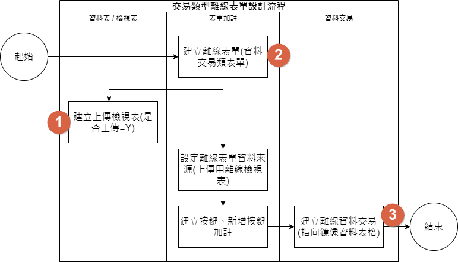

# 需求項目 

### [MAE離線功能]

## 規劃人員

Jacky Chen

## 規劃版本紀錄

|日期|版本|備註|
|:-:|:-:|:-:|
|2020/11/19|v1||

## TRAC

#8989

## 主要流程

#### 1. 案例

![alt 離線資料-案例[流程]](離線資料-案例[流程].png)

* ### 新增離線任務流程
    * #### 前置條件
    > 無
    * #### 作業流程

    * #### 設定畫面

    * #### 完成狀態
    > 無

* ### 離線表單設計流程
    * #### 前置條件
    > 無
    * #### 作業流程

    * #### 設定畫面

    * #### 完成狀態
    > 無

* ### 離線準備表單設計流程
    * #### 前置條件
    > 無
    * #### 作業流程

    * #### 設定畫面

    * #### 完成狀態
    > 無

* ### 交易類型離線表單設計流程
    * #### 前置條件
    > 無
    * #### 作業流程

    * #### 設定畫面

.png)

    * #### 完成狀態
    > 無

## 替代流程
> 無
## 例外流程
> 無
## 規格說明 [商業邏輯 / 企業規則]

> 1. 離線作業期間一人一機、無共用
> 2. 使用者必須在可以連上RTE時，先登入系統、然後完成切換進入離線模式、才能離線作業
> 3. 離線時期新增的資料暫存於MAE本地資料表，並提供設計者新增、查詢、修改、刪除功能運用。
> 4. 離線模式以個別獨立任務的型式運作（一個任務的過程包含匯出、儲存、異動、匯入、清除）
> 5. 提供函數取得離線作業需要下載的資料所需要的預估儲存空間值（由欄位資料結構總和乘以筆數、並彙整所有資料來源）、讓使用者可以在設定離線過濾篩選資料條件表單，得知行動裝置所需要暫存空間大小預作準備。
> 6. 要結束離線作業模式，先手動觸發進入在線模式準備狀態，然後MAE先匯入離線時儲存於MAE的資料進入RTE暫存資料表、此時MAE端即完成匯入作業、結束離線作業，進入在線模式。
> 7. 離線期間使用觸發離線作業的使用者身分作為匯入資料的權限依據、而匯入作業亦須由啟用離線模式的使用者完成作業後切換回在線作業模式完成整個任務，中途不能更換使用者。
> 8. 使用者於完成匯入後自動彈出同步表單處理資料檢查與同步作業，當使用者確認上傳完成後（以資料筆數為依據）由使用者確認結束離線作業後清除離線資料，或提供使用者重新上除資料。
> 9. 任務可以不強制掛載同步表單，所以離線結束時可以不自動開啟同步表單。
> a.離現階段
> 10. 兩階狀態（在線 > 離線 > 在線）
>    * 於在線作業模式下設定匯出離線用多個資料檔的過濾條件、並提供使用者離線資料量資訊，由使用者自行確認裝置資源是否可以符合運作需求
>    * 確認過濾條件後隨即啟動進入離線作業
>        * 從雲端匯出所有離線用資料到MAE行動裝置
>        * 行動裝置進入離線作業模式
>    * 結束離線作業模式進入在線作業模式
>        * 從MAE行動裝置啟動匯入離線暫存資料到雲端
>        * 行動裝置進入在線作業模式
> 11. 運用[離線任務]來整合離線表單
>   * 每一次離線只能選擇一個[離線任務]確保作業的獨立性
>   * 離線任務由設計者設計，運行端不能更改
>   * 單一離線任務只有一張首頁表單
> 12. 離線期間只能看見離線表單、在線期間只能看見在線表單，當完成啟用離線作業後MAE清除在線表單直接顯示離線表單
> 13. 離線主檔下載的過濾條件
>   * 設計者必須設計表單讓使用者指定離線資料的過濾條件。
>   * 使用者啟用離線模式後跳出過濾條件設定表單設定過濾條件，完成設定後直接將資料匯出，完成後進入離線模式。
>   * 如果離線準備動作失敗則跳出錯誤提示訊息，並清除已下載資料維持在線模式、且回到條件設定畫面。
>   * MAE自動下載離線表單其他所需資訊。
>   * 提供離線資料需要容量讓使用者參考。
> 14. 要進入在線模式時
>   * MAE中待處理交易資料整批匯入RTE即完成匯入作業結束離線模式
>   * 設計者需負責設計檢查資料用的[資料交易]及[同步處理]表單（在線MAE / RTE表單）
>   * 使用者透過同步表單執行檢查、修改、完成同步等作業
>   * 當MAE完成匯入作業後即結束離線作業，當使用者確認後隨即清除離線資料。
>   * 使用者可以強制清除無法完成匯入的資料，強制結束離線作業回到在線模式。
>   * 當回到在線模式時清除離線表單取得在線表單資訊，並回到系統首頁。
> 15. 支援多筆表單（主檔）開啟單改表單（交易異動），並傳遞相關參數、由單改表單進行異動
> 16. 支援下拉選單透過查表（主檔）顯示下拉選項
> 17. 離線表單必須使用[離線檢視表]、離線檢視表如勾選[產生鏡像資料表]則自動產生匯入用資料表，MAE也會於結束離線作業時自動匯入資料於[匯入用鏡像資料表]。
> 18. RTE提供管理介面，可以取得RTE離線任務資訊、管理匯入作業（可以禁止特定使用者的離線任務上傳）。

## 附件紀錄

#### 1. 資料結構

![alt 離線資料[流程]](MAE離線-20201019.png)