# 安裝 Git

> 1.啟動安裝 [按 next]

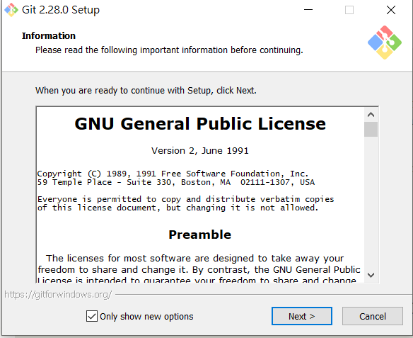

> 2.選擇安裝項目(預設) [按 next]

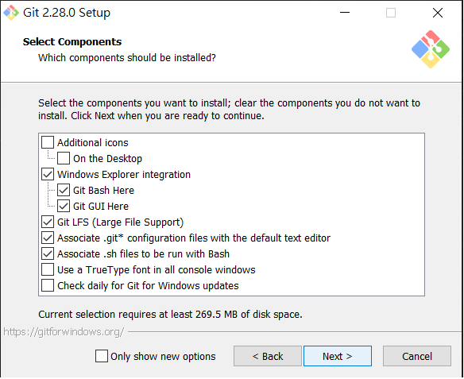

> 3.選擇與VS Code整合(建議) [按 next]

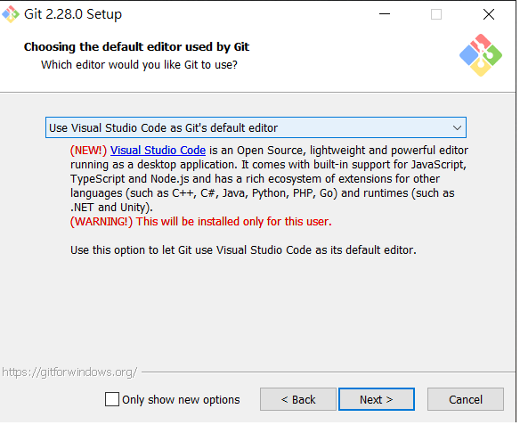

> 4.選擇環境設定方式(預設) [按 next]

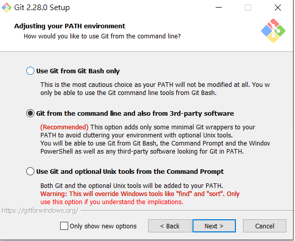

> 5.選擇加密方式(由於沒有AD憑證中心所以選預設) [按 next]

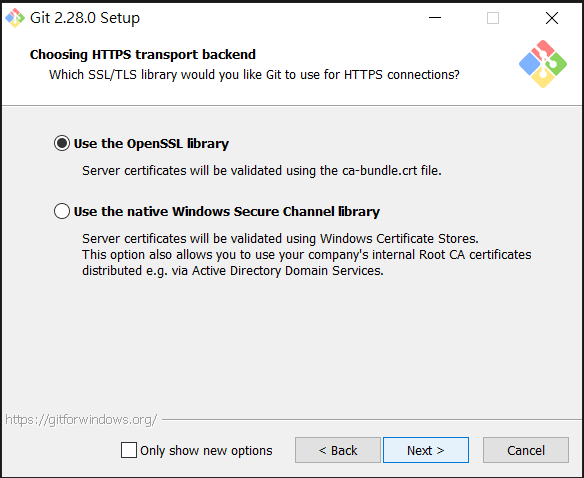

> 6.選擇斷行格式(預設) [按 next]

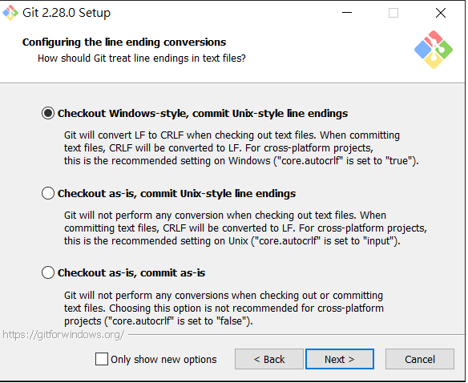

> 7.選擇console(預設) [按 next]

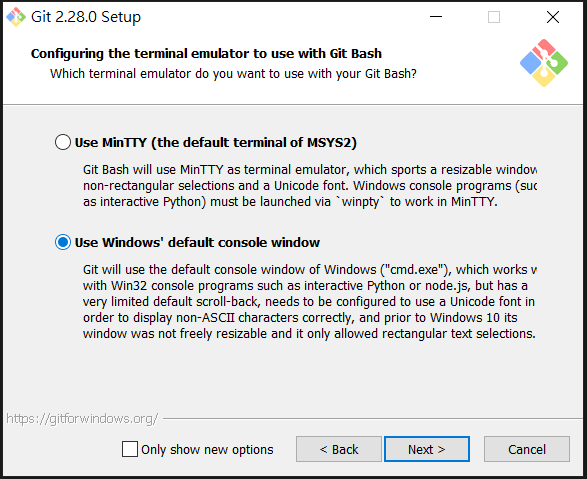

> 8.選擇合併方式(預設) [按 next]

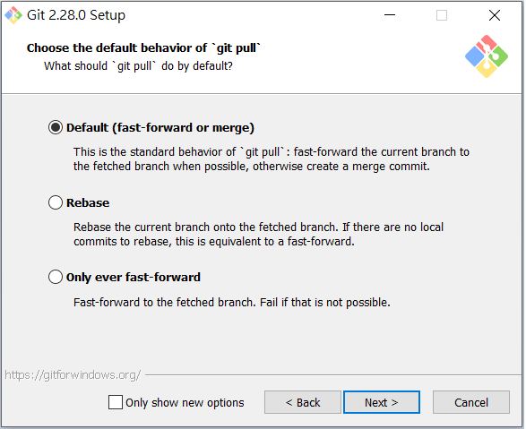

> 9.選擇平台支援(預設) [按 next]

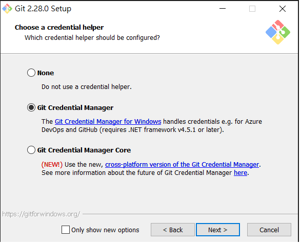

> 10.是否啟用快取(預設) [按 next]

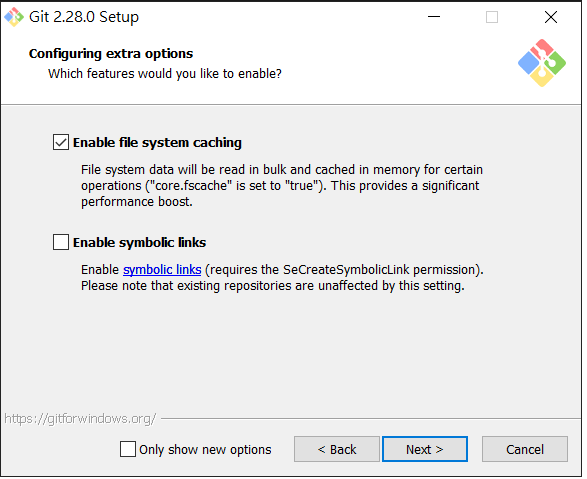

> 11.對console況置選擇(預設) [按 install]

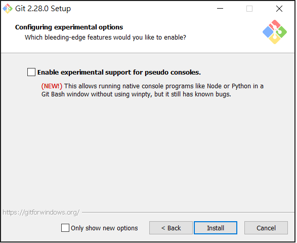

> 12.安裝中........

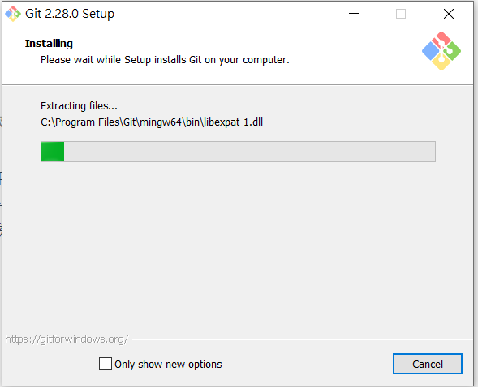

> 2.是否啟動設定精靈、完成安裝 [按 next]

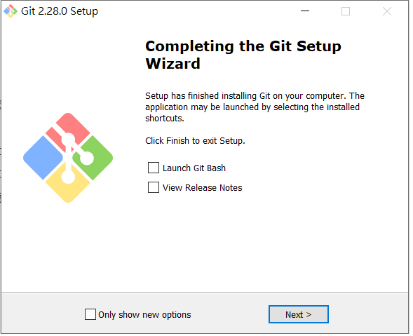

-----------------------

# 安裝 TortoiseGit

#### 安裝主程式

> 1.啟動安裝 [按 next]

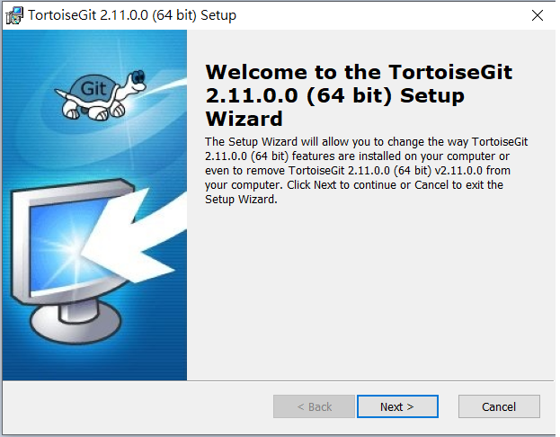

> 2.選擇安裝項目 [按 next]

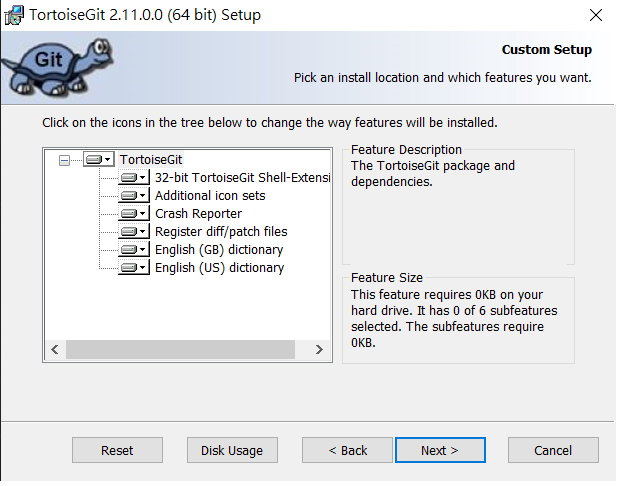

> 3.確認執行 [按 install]

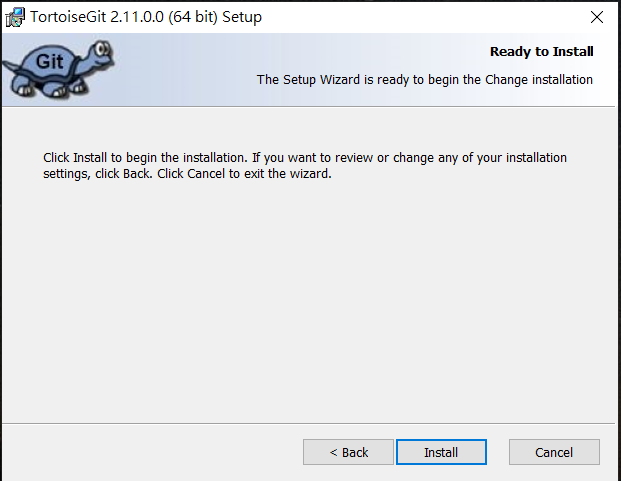

> 4.完成主程式安裝  [按完成]

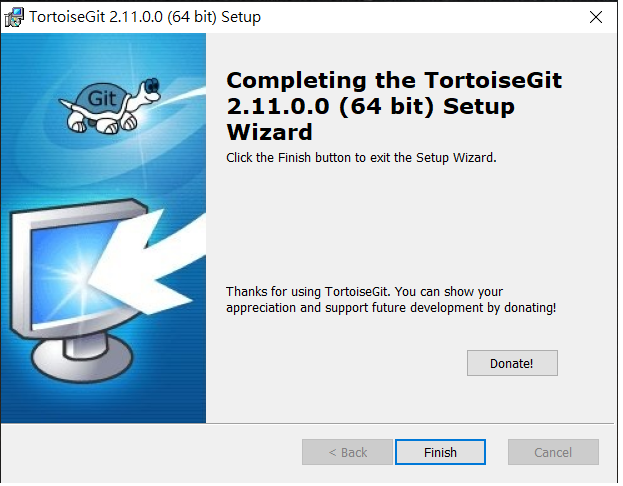

#### 安裝中文語系

> 1.起始安裝 [按下一步]

> 2.完成安裝 [按完成]

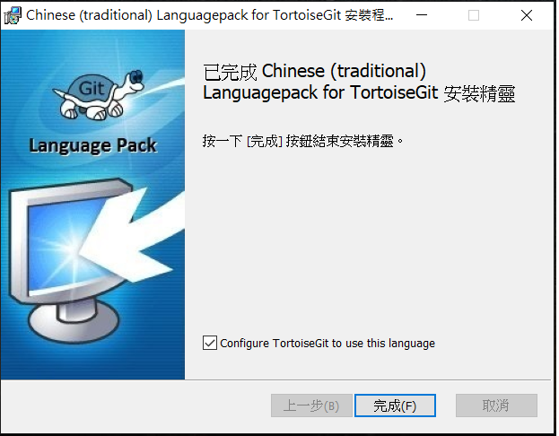

> 3.完成安裝後在建立過GIT庫的路徑下按滑鼠右鍵就可以看到子選單新增內容

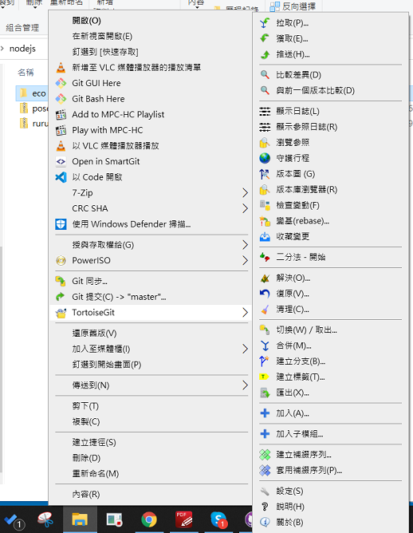