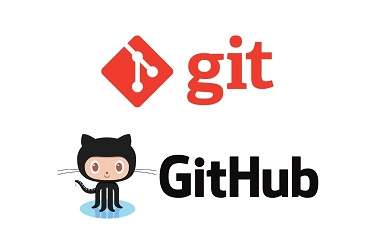

# GIT 快速介紹

> 一般在軟體開發中又分為中央式系統（例如：Subversion、CVS 等）與分散式系統（例如：Git、BitKeeper、mercurial 等），中央式版本控制系統的工作主要在一個伺服器進行，由中央管理存取權限「鎖上」檔案庫中的檔案，一次只能讓一個開發者進行工作。而分散式系統讓不同開發者直接在各自的本地檔案庫工作，並容許多個開發者同時更動同一個檔案，而每個檔案庫有另外一個合併各個改變的功能。分散式系統讓開發者能在沒有網路的情況下也能繼續工作，也讓開發者有充分的版本控制能力，而不需經中央管理者的許可，但分散式系統仍然可以有檔案上鎖功能。

# [使用教學 - 連猴子都能懂的GIT指南](https://backlog.com/git-tutorial/tw/intro/intro1_1.html)

#### 開源的用戶端軟體

[GIT程式](https://git-scm.com/download)

* [Windows安裝檔](https://github.com/git-for-windows/git/releases/download/v2.28.0.windows.1/Git-2.28.0-64-bit.exe)

[TortoiseGit](https://tortoisegit.org/)

* [Windows安裝檔](https://download.tortoisegit.org/tgit/2.11.0.0/TortoiseGit-2.11.0.0-64bit.msi)

* [中文語系檔](https://download.tortoisegit.org/tgit/2.11.0.0/TortoiseGit-LanguagePack-2.11.0.0-64bit-zh_TW.msi)