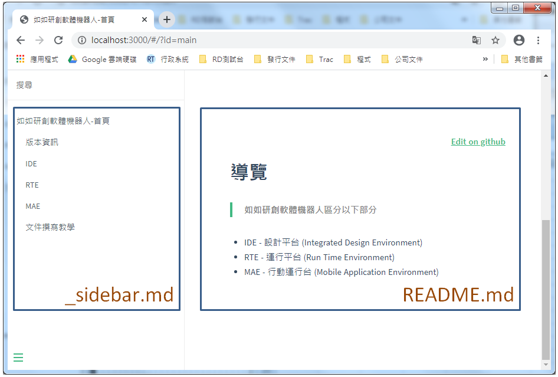

# docs 資料夾

* 檔案說明

        +- docs 資料夾
                +- index.html (設定)
                +- README.md (頁面內容)
                +- _sidebar.md (側邊導航欄內容)
                +- ...

    * 範例

        

        * README.md

            內容如下：

                # 導覽

                > 如如研創軟體機器人區分以下部分

                * IDE - 設計平台 (Integrated Design Environment)
                * RTE - 運行平台 (Run Time Environment)
                * MAE - 行動運行台 (Mobile Application Environment)    

            > 注意 : 此處若有連結時
                當relativePath=true時，資料夾路徑須為`相對路徑`。不能使用 ` ../ `。
                當relativePath=false時，資料夾路徑須為`相對路徑`。
                斜線須為` / `。

        * _sidebar.md

            內容如下：
            
                * 如如研創軟體機器人 - 首頁
                    * [版本資訊](RELEASE/README.md)
                    * [IDE](IDE/README.md)
                    * [RTE](RTE/README.md)
                    * [MAE](MAE/README.md)
                    * [文件撰寫教學](teaching/README.md)

            > 當點擊連結時

                頁面 : 顯示指定的檔案。
                側邊導航欄 : 指定檔案的路徑下的`_sidebar.md`內容。若該路徑下沒有`_sidebar.md`，則會顯示父路徑下的`_sidebar.md`內容。
            
            > 注意 : 此處若有連結時
                當relativePath=true時，資料夾路徑須為`相對路徑`。
                當relativePath=false時，資料夾路徑須為`完整路徑`。
                斜線須為` / `。

* 資料夾

    * 命名
        * 不可為中文
        * 大小寫皆可

